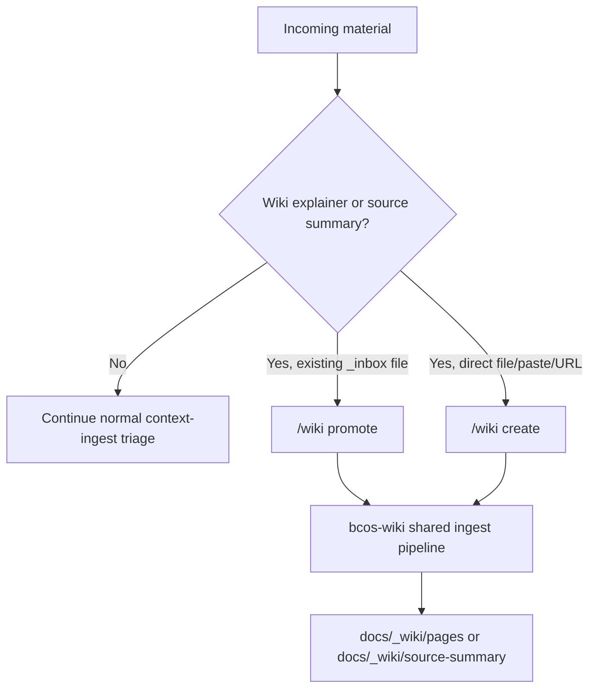

# Context Ingest

## Purpose

**This skill IS:**

- The entry point for getting new knowledge INTO your context architecture
- A router that sends information to the correct owning data point
- A classifier that determines what type of knowledge you're adding
- The mechanism that makes your context system compound over time

**This skill IS NOT:**

- Creating the initial context architecture (use `context-onboarding` for that)
- Auditing existing context (use `context-audit` for that)
- A raw file storage system (it extracts and integrates, not archives)

---

## When to Use

- "Here's our new brand guidelines PDF — integrate it" → **integrate** into active docs
- "Save these meeting notes for later" → **dump** to `_inbox/`
- "I have an idea about enterprise pricing" → **park** in `_planned/`
- "I read this article — not sure if it's relevant" → **triage** — Claude reads, recommends a path
- "Our competitor just launched a new product" → **integrate** into competitive positioning
- "Watch this YouTube video and capture what matters" → **triage** — Claude extracts, asks where
- "I pasted some notes — figure out where they belong" → **triage** — Claude classifies, user decides
- "Fetch our brand doc from Google Drive" → **fetch + integrate** via MCP connector
- "We have hundreds of call recordings in Notion" → **map** as external reference, don't copy

---

## Front-door dispatch (use first)

`context-ingest` is the **single public entry point** for new material. Detect the input shape *before* asking the user, and dispatch to the specialist skill when one fits — don't make the user know which slash command to type.

| Input shape | Dispatch to | Why |
|-------------|-------------|-----|
| HTTP/HTTPS URL (article, GitHub, YouTube) | `/wiki run <url>` (the `bcos-wiki` skill, Path A) | Wiki owns external-source ingest, banner citations, schema validation, refresh tier |
| Path inside `docs/_inbox/` and user says "make this a wiki page" | `/wiki promote <path>` (Path B) | Wiki owns the `_inbox/` → `_wiki/pages/` promotion |
| Local file or pasted text — runbook, SOP, decision narrative, post-mortem, glossary entry, FAQ, transcript, research clipping, customer-call notes | `/wiki create from <path-or-paste>` (Path B) | Per [plugin-storage-contract.md](../../../docs/_bcos-framework/architecture/plugin-storage-contract.md) Rule 2, the wiki is the universal long-form / cross-cutting content destination. Don't route to `_collections/` (legal-weight only) or `docs/operations/<custom>` (that's a folder pattern that bypasses wiki tooling). |
| Slack export, meeting transcript, chat log, call recording transcript | `context-mine` first → its output lands in `_inbox/` → resume `context-ingest` triage on the result | Mine is the extraction preprocessor; ingest is the classifier/router. The processed `_inbox/` capture then typically routes to `/wiki promote` (transcripts are informational long-form content — Rule 2). |
| Loose notes, pasted text, brain dump, "save this for later" | Stay in `context-ingest` (use AskUserQuestion below) | This skill owns inbox/planned/active classification |

If the dispatch is unambiguous (a URL is a URL), invoke the specialist directly and tell the user one sentence about what you did. If the input is mixed (e.g. Slack export *and* a URL), do mine first, then handle the URL via `/wiki run` separately, then return to ingest for whatever's left.

**Wiki zone not initialized?** If the user's content routes to `/wiki create from` or `/wiki promote` but the target repo has no `_wiki/` zone, the bcos-wiki SKILL.md Guard fires AskUserQuestion offering: (a) init with defaults + proceed [Recommended], (b) full interview + proceed, (c) cancel. Do **not** route around the wiki to `docs/operations/<custom>` or `_collections/` — that creates a parallel storage path that breaks Rule 2's substrate guarantee.

`context-routing` (`/context`) is **retrieval, not ingest** — never dispatch there from here.

---

## The Ingest Process

### Step 1: Receive and Triage

Accept input in any form:
- A file path (markdown, PDF, text)
- A URL (Claude reads the page, YouTube videos, articles)
- Pasted text in the conversation
- A description of what changed ("we decided to pivot to enterprise")

Note what the source is and where it came from. This becomes the source citation.

**Special case — session captures (`docs/_inbox/sessions/*.md`):**
These are auto-generated by the session save hooks. They already have frontmatter (`type: session-capture`) and are pre-structured into Decisions, Discoveries, Follow-ups, and Files Changed. When processing these:
- Skip the triage question — they're already classified
- Extract actionable items and route to owning data points
- Check `.claude/registries/entities.json` for entity disambiguation
- Delete the session file after successful integration (or leave it for prune_sessions.py)

**For all other inputs, use the `AskUserQuestion` tool:**
- Question: "What do you want to do with this?"
- Options: **Save for later** (dump to _inbox/) / **It's an idea** (park in _planned/) / **Integrate it** (classify and route to active docs) / **Add to collection** (bulk similar files) / **Not sure** (I'll read it and recommend)

| User says... | Action | Where it goes |
|-------------|--------|--------------|
| "Just save this for later" / "Dump it" / "I'll deal with it later" | Save as-is to `docs/_inbox/` with a descriptive filename. No processing needed. Done. | `docs/_inbox/meeting-2026-04-06.md` |
| "This is an idea" / "Might do this someday" / "Park it" | Extract the core concept, create a clean doc in `docs/_planned/`. Frontmatter recommended but linking optional. Done. | `docs/_planned/enterprise-tier.md` |
| "Integrate this" / "Update our context" / "This is real now" | Proceed to Step 2 below — full classify → find owner → integrate flow. | Active data points in `docs/` |
| "I have a bunch of these" / bulk similar files (call transcripts, reports, invoices) | Route to a collection folder. Keep original filenames. Append entry to collection index if one exists. See `docs/_bcos-framework/architecture/content-routing.md` Path 5. | `docs/_collections/[type]/` |
| "Make this a wiki page" / "Turn this into an explainer" / "_inbox item should become wiki" | Use the wiki-promotion path. Route existing `_inbox/` material to `/wiki promote`; route direct uploads, URLs, or pasted content to `/wiki create`. | `docs/_wiki/pages/` or `docs/_wiki/source-summary/` |
| "Not sure where this goes" | Read the content, show the user a summary + your recommendation (inbox / planned / integrate / collection), let them decide. | Depends on user choice |

**NEVER create folders not defined in the architecture.** Valid destinations: `docs/` (active), `_inbox/`, `_planned/`, `_archive/`, `_collections/[type]/`, and `_wiki/` through the `bcos-wiki` skill. If content doesn't fit, ask the user.

**For _inbox deposits:** Create the file with a simple header:

```markdown
# [Descriptive title]

**Source:** [URL / meeting / person]
**Date:** [today]
**Deposited by:** context-ingest (unprocessed)

---

[Raw content here]
```

**For _planned deposits:** Use the data point template but with relaxed requirements:

```markdown
---
name: "[Concept Name]"
type: context
cluster: "[Best guess]"
status: draft
created: "[today]"
last-updated: "[today]"
# Optional: declare an exit trigger if the idea has a natural staleness clock
# lifecycle:
#   expires_after: 90d   # if untouched for 90d, lifecycle-sweep flags as idea-dead
---

## Concept

[Polished description of the idea]

## Why This Matters

[Why it might be worth doing]

## Open Questions

- [What needs to be figured out before this becomes active]
```

### Step 1.5: Time-Bounded Content — Declare a Lifecycle Trigger

Whenever the captured content has a **natural exit point** — a proposal that will be sent, a meeting note that will fold into an SOP, a research dump that will become a wiki page, a dated snapshot that will be replaced — **prompt the user to declare a `lifecycle:` frontmatter field**. This is what makes the content self-describing for the `lifecycle-sweep` job (see [`docs/_bcos-framework/methodology/document-standards.md`](../../../docs/_bcos-framework/methodology/document-standards.md) §"Lifecycle Triggers").

**When to prompt** (the captured content matches one of these shapes):

| Content shape | Suggested lifecycle |
|---|---|
| Outbound draft (proposal, pitch, post, application) | `archive_when: "proposal-sent"` + `expires_after: 60d` |
| Meeting / call notes | `fold_into: <target-sop-or-engagement-doc>` + `expires_after: 14d` |
| Research dump with external URL(s) | `route_to_wiki_after_days: 30` |
| Dated analysis / point-in-time snapshot | `archive_when: "decision-made"` + `expires_after: 90d` |
| Call transcript or evidence file | `route_to_collection: "<type>"` + `archive_when: "outcome-known"` |

**How to prompt** — use the `AskUserQuestion` tool:
- Question: "This looks time-bounded. Declare a lifecycle exit trigger?"
- Options: **Yes — pick the suggested shape** / **Yes — let me specify** / **No — leave it open** / **Not sure — explain**

If the user declines, the doc still works — the sweep will fall back to routing-rule pattern match. Adding a trigger upgrades it from "guessed" to "self-describing".

### Step 2: Classify the Content

**Only reach this step if the user chose "integrate" in Step 1.**

Identify what KIND of knowledge this is AND how to handle it:

| Content Type | Route To | Handling Mode |
|-------------|----------|--------------|
| Company identity, mission, values | Company/identity data points | synthesize |
| Customer info, audience, segments | Audience data points | synthesize |
| Product/service changes | Product/value data points | synthesize |
| Process changes, workflow updates, SOPs | Process documents | **wrap** (preserve content) |
| Market shifts, competitor moves | Market/competitive data points | synthesize |
| Policy changes, rules, brand guidelines | Policy documents | **wrap** (preserve rules) |
| New facts, reference data, glossaries | Reference documents | **catalog** (preserve as-is) |
| Strategic decisions, direction changes | Strategy data points | synthesize |
| External bulk collections (100+ similar files) | External reference data point | **map** (don't copy) |

**Handling modes:**
- **synthesize** — combine from multiple sources into a new or updated data point
- **wrap** — add CLEAR structure around existing content without changing it. Never rewrite SOPs, processes, or policies — a changed step could break a real workflow
- **catalog** — add minimal frontmatter, keep content completely as-is
- **map** — create a reference data point describing where to find external content

If the content spans multiple types, split it and route each piece separately.

### Wiki-Promotion Path

Use this path when the content should become explanatory/wiki material, not a
canonical active data point. The wiki owns derivative explainers, source
summaries, glossaries, how-tos, and operational narratives that build on active
docs without replacing them.



Routing rules:

- Existing material under `docs/_inbox/` -> `/wiki promote <path>`.
- Direct local file, paste, or URL -> `/wiki create <source>`.
- URL queues that should be fetched later -> `/wiki queue add <url>`.
- Canonical business facts still go to active data points first; wiki pages use `builds-on` to cite them.
- Path B binaries stay inside `docs/_wiki/raw/local/`; do not write wiki-promoted files to `_collections/` unless the user explicitly asks for a collection operation.

**External sources (MCP connectors):** If the content comes from a connected system (Google Drive, Notion, etc.), the same modes apply. Fetch individual docs for integrate/wrap/catalog. For large collections, use map mode — create a reference data point instead of copying everything locally.

**Temporal check — is this about now or the future?**

If the content made it to Step 2, the user chose "integrate." But double-check the temporal signals:

| Signal in the content | Action |
|----------------------|--------|
| "We currently...", "Our pricing is...", "We serve..." | Integrate into active docs (proceed to Step 3) |
| "We plan to...", "Next quarter...", "We're considering..." | **Stop.** This belongs in `docs/_planned/`, not active docs. Route back to Step 1 triage as a planned deposit. |
| "We used to...", "Previously...", "Before the pivot..." | May update `_archive/` or inform an active doc's Context section |

**Important:** Do not merge future-state content into an active document without discussing with the user.

### Step 3: Find the Owner

**Pre-read (cheap, do this first):** if `docs/document-index.md` exists, read it before scanning individual files. It is the canonical inventory — one file lists every active data point, its DOMAIN, EXCLUSIVELY_OWNS, and cluster. Use it to narrow candidates to 1-3 likely owners; only then open those files. This avoids the grep-every-file failure mode and is dramatically cheaper than discovering ownership one file at a time.

If `document-index.md` does not exist yet (early-stage repo), use `/context search <topic>` to rank candidate owners via the canonical index. Fall through to per-file reading only if both are unavailable.

For each piece of knowledge:

1. **Check existing data points** — does one already OWN this topic?
   - Use the document-index / `/context search` shortlist from the pre-read
   - Read the EXCLUSIVELY_OWNS section of candidate data points
   - If a clear owner exists → route there

2. **Check STRICTLY_AVOIDS** — make sure you're not putting it in the wrong place
   - If data point X says "STRICTLY_AVOIDS competitor analysis" → don't put competitor info there

3. **No owner found?** → Recommend creating a new data point
   - Suggest a name, cluster, and initial DOMAIN
   - Use the template from `docs/_bcos-framework/templates/context-data-point.md`

### Step 4: Integrate

For each affected data point:

1. **Read the current content** of the owning data point
2. **Merge the new knowledge** into the appropriate section:
   - New facts → Content section
   - New strategic implications → Context section
   - Source info → Sources section (if it exists)
3. **Check for contradictions** with existing content:
   - If the new info contradicts existing content → flag it, don't silently overwrite
   - Present both versions to the user and ask which is current
4. **Update metadata:**
   - Bump `version` (at least patch)
   - Update `last-updated` to today
   - Never touch `created`
   - Keep or add useful `tags` for search/dashboard/Galaxy filtering
   - Do not set `last-reviewed` for a content edit unless the doc was also checked and confirmed as current; use `last-reviewed` for validation without content mutation

### Step 5: Update Cross-References

After integrating:

1. **Check relationships** — does this new knowledge affect other data points?
   - If market context changed → competitive positioning may need review
   - If audience changed → messaging and value prop may need review
2. **Update BUILDS_ON / REFERENCES / PROVIDES** if new connections emerged
3. **Update Document Index** (`docs/document-index.md`) if it exists:
   - Run `python .claude/scripts/build_document_index.py` after material changes
   - This also refreshes `.claude/quality/context-index.json`, the machine-readable index used by automations, dashboard, Galaxy, search, and filtering

### Step 6: Report

Summarize what happened:

```
## Ingest Summary

**Source:** [what was ingested]
**Date:** [today]

### Updates Made
- **[data-point-name]** (v1.2.0 → v1.3.0): Added [what]
- **[data-point-name]** (v2.0.1 → v2.0.2): Updated [what]

### Contradictions Found
- [data-point]: new info says X, existing content says Y → [resolved/flagged]

### New Data Points Recommended
- [suggested name]: [why needed]

### Cross-References Updated
- [data-point-A] now REFERENCES [data-point-B]

### Document Index
- [Updated / No changes needed]
```

---

## Handling Contradictions

When new information contradicts existing content:

1. **Don't silently overwrite.** The existing content may be deliberately different.
2. **Present both versions** to the user:
   - "Your market-context data point says X. The new source says Y. Which is current?"
3. **If user confirms the new version:** Update the data point, note the change in the changelog.
4. **If user says 'keep both':** Note the contradiction in the Context section as a known tension.
5. **If user is unsure:** Flag the data point as `status: under-review`.

---

## Batch Ingest

For multiple sources at once:

1. List all sources first
2. Classify each one
3. Group by target data point
4. Process one data point at a time (merge all relevant sources into it)
5. Report all changes at the end

**Recommendation:** Ingest one source at a time when possible. Stay involved. Check the summaries. Guide emphasis. Batch ingest is faster but less supervised.

---

## Source Citation

When integrating new knowledge, preserve where it came from:

```markdown
## Sources

| Claim | Source | Date | Confidence |
|-------|--------|------|------------|
| Market growing 15% YoY | Industry Report 2026 | 2026-03-15 | High |
| Competitor X raised Series B | TechCrunch article | 2026-04-01 | High |
| Customer segment shifting to enterprise | Q1 sales review | 2026-04-05 | Medium |
```

Not every claim needs a source. Use this for important facts, statistics, and claims that might be challenged or need periodic verification.

---

## Automatic Handoffs

After ingest completes, **automatically do these** (don't wait for the user to ask):

1. **→ Rebuild Document Index** — Always: `python .claude/scripts/build_document_index.py`
2. **→ Update current-state.md** — If the ingested content is significant, offer to update "What Changed Recently"
3. **→ context-audit** — If a new data point was created: "Want me to run a quick CLEAR audit on the new doc?"

## Integration with Other Skills

| Skill | How It Connects |
|-------|----------------|
| **context-onboarding** | Onboarding discovers what exists; ingest adds new knowledge to it |
| **context-audit** | After ingest, audit catches any boundary violations introduced |
| **daydream** | Reflection may reveal knowledge gaps; ingest fills them |
| **core-discipline** | Compounding rule triggers ingest: "file this insight back into context" |
| **clear-planner** | Large ingests (10+ sources) may need a plan first |
| **bcos-wiki** | Wiki-promotion route for explanatory pages, source summaries, and direct `/wiki promote` or `/wiki create` handoff |
| **lifecycle-sweep** (job) | Consumes the `lifecycle:` frontmatter declared at capture time. Step 1.5 prompts for it on time-bounded content. |

> **Architecture docs:** For routing design context, see [`docs/_bcos-framework/architecture/content-routing.md`](../../docs/_bcos-framework/architecture/content-routing.md)
