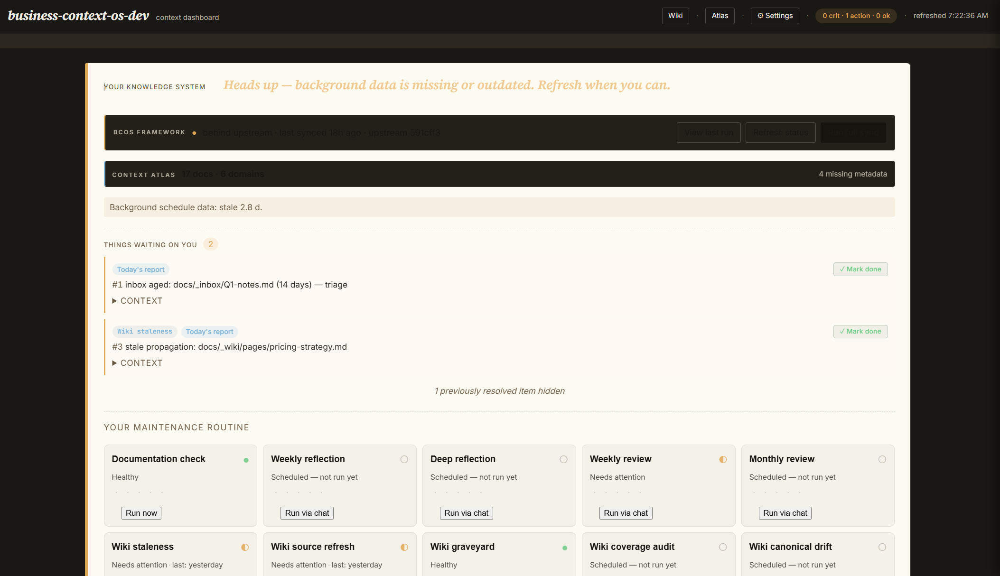
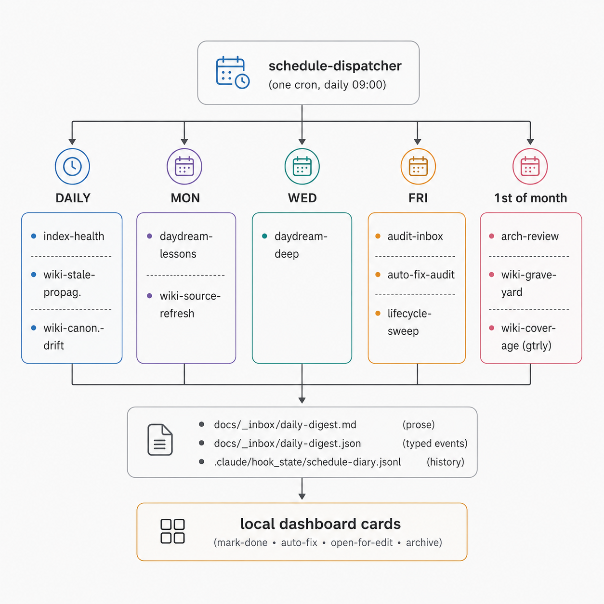

<p align="center">
  <h1 align="center">CLEAR Context OS</h1>
  <p align="center">
    <strong>Knowledge that maintains itself —</strong><br>
    so your AI doesn't act on what was true last month.
  </p>
  <p align="center">
    <a href="#install">Install</a> &nbsp;·&nbsp;
    <a href="#what-it-does">What it does</a> &nbsp;·&nbsp;
    <a href="#the-wiki-zone">Wiki zone</a> &nbsp;·&nbsp;
    <a href="#what-ships">What ships</a> &nbsp;·&nbsp;
    <a href="docs/_bcos-framework/guides/getting-started.md">Getting Started</a>
  </p>
  <p align="center">
    
    
    
    
    
    
  </p>
</p>

---

> Your AI had perfect context — two weeks ago. Then your strategy shifted, three meetings redefined priorities, and the docs you wrote on Monday are wrong by Friday. **CLEAR Context OS** is the maintenance layer your second brain never had: ownership boundaries enforced mechanically, staleness surfaced on a schedule, drift propagated across linked docs, a dispatcher that learns from your clicks. One source of truth per topic. Searchable. Task-aware. Never silently stale.

---

## Install

**Easiest — let Claude do it.** Open Claude Code in any directory and paste:

> *"Install BCOS from https://github.com/walm00/business-context-os and walk me through onboarding."*

Claude clones the repo, picks the right install path for your platform (Windows/macOS/Linux), runs setup, and steps straight into onboarding. No prereq checks to debug — if something's missing, Claude resolves it interactively.

**Or manually, one command:**

```bash
bash <(curl -fsSL https://raw.githubusercontent.com/walm00/business-context-os/main/install.sh)
```

(Requires `bash`, `curl`, and `tar` on PATH — fine on macOS/Linux and on Windows under WSL or Git Bash.)

Drop anything you already have — SOPs, brand docs, meeting notes, exports — into `docs/_inbox/` (skip if you're starting fresh). Then open Claude Code in that repo and say:

> *"Launch BCOS onboarding."*

That's the only prompt you need. Onboarding inspects your inbox, scans the rest of the repo, asks one Q&A round, and proposes the architecture for review. Works the same whether the repo is fresh or already full of context.

---

## From zero to running

```text
  INSTALL  →  DISCOVER  →  ALIGN  →  SCHEDULE  →  RUNNING
```

| # | Step | What happens |
|---|---|---|
| 1 | **Install** | One bash line drops the framework into any repo |
| 2 | **Discover** | Claude scans your repo + **any MCP you've connected** (Drive, Notion, Slack, Gmail, your CRM — whatever's wired in) for existing context, plus anything you've dropped into `docs/_inbox/` |
| 3 | **Align** | One Q&A round — project type, key sources, ownership boundaries. Architecture drafted for your review |
| 4 | **Schedule** | Pick maintenance cadence in plain English: *"audit twice a week"*, *"dispatcher at 08:30"*, *"deep daydream off"* |
| 5 | **Running** | Daily digest. Local dashboard. `/context bundle <task>` ready. Context compounds from here — the system maintains itself. |

**Simple, guided, automatic.** Claude walks you through each step — you review, you decide. **Nothing deleted along the way** — originals preserved or archived, never silently overwritten.

---

## What it does

**Stops context rot in three ways:**

| | What it does |
|---|---|
| **Organize** | Every doc declares what it owns. CLEAR boundaries prevent the same fact living in 5 places. |
| **Maintain** | Scheduled jobs check freshness, surface stale docs, propagate updates across linked content. |
| **Use** | `/context search` and `/context bundle <task>` give Claude curated, freshness-aware, source-of-truth-ranked context for the job at hand. |

**The folder tells the LLM what to trust.** Claude reads the path before the content: `docs/*.md` = canonical, `_planned/` = not yet real, `_archive/` = history, `_inbox/` = unprocessed, `_collections/` = verbatim evidence, `_wiki/` = explanatory. The hierarchy is the trust signal — fewer tokens spent re-deciding, no chance of treating an archived draft as today's truth.

```text
docs/
├── *.md                  ← canonical data points (one source of truth per topic)
├── document-index.md     ← auto-generated TOC
├── current-state.md      ← what's true right now + what changed recently
├── table-of-context.md   ← high-level cluster map for orientation
├── _inbox/               ← drop zone — Claude triages on demand
├── _planned/             ← polished ideas, not yet real
├── _archive/             ← superseded — kept, not deleted
├── _collections/         ← verbatim evidence (invoices, contracts, transcripts)
│   └── <type>/_manifest.md   (each collection has a manifest)
├── _wiki/                ← derivative knowledge (how-tos, source summaries)
│   ├── pages/            ← user-authored explainers
│   ├── source-summary/   ← external captures with citation banners
│   ├── raw/              ← original artifacts (PDFs, HTML)
│   └── queue.md          ← URLs awaiting fetch
└── _bcos-framework/      ← framework docs — never user content
    ├── architecture/     ← 12 zone + system architecture docs
    ├── methodology/      ← 5 CLEAR + ownership + standards docs
    ├── patterns/         ← 8 project-type starting templates
    └── templates/        ← 15 frontmatter / schema / starter files
```

---

## The wiki zone

Inspired by [Karpathy's LLM Wiki approach](https://gist.github.com/karpathy/442a6bf555914893e9891c11519de94f) — give the LLM a wiki of *your* knowledge, the way you'd brief a smart new hire.

Save anything to the wiki, from anywhere:

```text
/wiki run https://stripe.com/docs/api          ← fetch a URL, summarize, cite
/wiki create from /Users/me/Downloads/spec.pdf ← extract a PDF, link to the binary
/wiki promote docs/_inbox/meeting-notes.md     ← turn an inbox capture into a wiki page
```

The wiki holds **how-tos, runbooks, glossaries, source summaries, post-mortems, decision logs** — derivative knowledge that explains and supports your canonical data points. Every page cites what it builds on. Stale pages surface automatically when their sources advance.

Wiki content is searchable alongside the rest of your context:

```text
/context search "stripe billing"       ← cross-zone search, ranked by source-of-truth
/context bundle market-report:write    ← curated bundle for a specific task
```

---

## The dashboard

A local cockpit at <http://127.0.0.1:8091> that shows your system at a glance — no third-party services, no telemetry, no logins.



```bash
python .claude/scripts/bcos-dashboard/run.py
```

| Surface | What you see |
|---|---|
| **Cockpit** | One-line status (healthy / N waiting / heads-up). Per-job dot strip for every maintenance job (core BCOS + wiki zone). |
| **Update** | "Run full sync" button → `update.py` + CLAUDE.md drift review + auto-commit + push, with a live log drawer. |
| **Schedules** (`/settings/schedules`) | Per-job preset buttons (`daily`, `mon_wed_fri`, `weekly_mon`, `off`) + the global **auto-commit** toggle + auto-fix whitelist. Saves directly to `schedule-config.json`. |
| **Run history** (`/settings/runs`) | Last 20 dispatcher runs with filter chips (job / verdict / trigger). |
| **File health** (`/settings/files`) | Frontmatter / cross-reference / staleness findings with one-click fixes. |

The dashboard is read-mostly: data flows from the dispatcher's diary, the schedule config, and the canonical context index. Writes (mark-done, schedule preset, auto-commit toggle, file fix) go through dedicated POST endpoints.

---

## Requirements

- **Claude Code** (desktop app, CLI, or web)
- **Python 3.8+** on `PATH`
- **bash** (default macOS bash 3.2 is fine)

---

## Updating

```bash
python .claude/scripts/update.py
```

Refreshes framework files only — skills, hooks, scripts, templates. Your `docs/` and `.private/` are never touched.

---

## Maintenance

One scheduled task per repo. The dispatcher reads `schedule-config.json`, runs the jobs due today, writes one consolidated digest at `docs/_inbox/daily-digest.md`, and surfaces findings as one-click cards in the dashboard.



You can tune any of it in plain English:

> *"Run the audit twice a week."*  · *"Move dispatcher to 08:30."*  · *"Turn off deep daydream."*

The system learns from your clicks. After three consistent uses of the same fix, the dashboard pre-selects it as a "✨ suggested" action — you accept or reject. Reversals trigger an automatic safety brake.

---

## CLEAR — the methodology

Five principles, one rule each:

- **C** — **Contextual Ownership** · one document owns each topic. No duplicates.
- **L** — **Linking** · reference sources; don't copy them.
- **E** — **Elimination** · consolidate; don't keep two versions.
- **A** — **Alignment** · context that doesn't support decisions doesn't belong.
- **R** — **Refinement** · structured maintenance, not ad-hoc fixes.

The whole framework is the mechanical implementation of these five rules.

---

## What ships

Everything below installs as one repo drop-in. No third-party services, no logins, no telemetry — all state lives in your `.claude/` and `docs/` folders.

| Layer | Count | Examples |
|---|---|---|
| **Skills** (chat-invokable via slash command) | 17 | `clear-planner` · `bcos-wiki` · `context-routing` · `context-audit` · `context-ingest` · `daydream` · `learning` · `schedule-tune` · `lessons-consolidate` · `ecosystem-manager` |
| **Sub-agents** (delegated bounded tasks) | 3 | `wiki-fetch` · `explore` · plus one optional |
| **Scripts** (mechanical Python) | 46 | `lifecycle_sweep` · `run_wiki_*` (5) · `cmd_wiki_*` (7) · `auto_fix_audit` · `bcos_inventory` · `digest_sidecar` · `record_resolution` |
| **Hooks** (auto-validation on edit) | 4 | post-edit frontmatter check · post-commit context check · pre-compact save · auto-save session |
| **Maintenance jobs** (scheduled, one dispatcher) | 12 | `index-health` · `audit-inbox` · `daydream-lessons` · `daydream-deep` · `architecture-review` · `auto-fix-audit` · `lifecycle-sweep` · `wiki-stale-propagation` · `wiki-source-refresh` · `wiki-graveyard` · `wiki-coverage-audit` · `wiki-canonical-drift` |
| **Auto-fix IDs** (silent dispatcher fixes) | 12 | `missing-last-updated` · `eof-newline` · `frontmatter-field-order` · `wiki-mark-queue-ingested` · `wiki-archive-expired-post-mortem` |
| **Architecture docs** | 12 | `wiki-zone.md` · `lifecycle-routing.md` · `typed-events.md` · `context-zones.md` · `content-routing.md` · `wiki-headless-scripts.md` |
| **Methodology docs** | 5 | CLEAR principles · context architecture · decision framework · document standards · ownership specification |
| **Project patterns** (starting templates by project type) | 8 | client-project · gtm · marketing · operational · product-development · product-service · internal-tool-app · internal-tool-automation |
| **Templates** (frontmatter, schema, starters) | 15 | data-point · cluster · current-state · table-of-context · wiki-schema · wiki-config · session-diary-starter |

Every script and skill is documented at the source. Every job has a reference doc under `.claude/skills/schedule-dispatcher/references/job-*.md`. Every typed-event finding maps to a renderer in the dashboard cockpit. Adding a new check means dropping a `cmd_*.py` or `run_*.py`, registering it in one map, and the dashboard picks it up.

---

## Contributing

Contributions welcome — open an issue or submit a PR targeting the `dev` branch. CI runs frontmatter, reference, and ecosystem-integration checks on every PR.

The fastest contribution path is **lessons learned.** As you use the system it captures insights; if you find one universal, contribute it back.

---

## Origin

Built by **[Guntis Coders](https://github.com/walm00)** after two years of operating context systems in production. The CLEAR methodology emerged from a practical problem: AI context degrades silently, and no amount of one-time documentation prevents it. The solution required a system — ownership boundaries, automated maintenance, self-learning, and structured reflection.

Background: [What is the Table of Contexts and why does it matter](https://medium.com/businessacademy-lv/what-is-the-table-of-contexts-and-why-does-it-matter-8ec2a9557e9f).

---

## License

[MIT](LICENSE)
