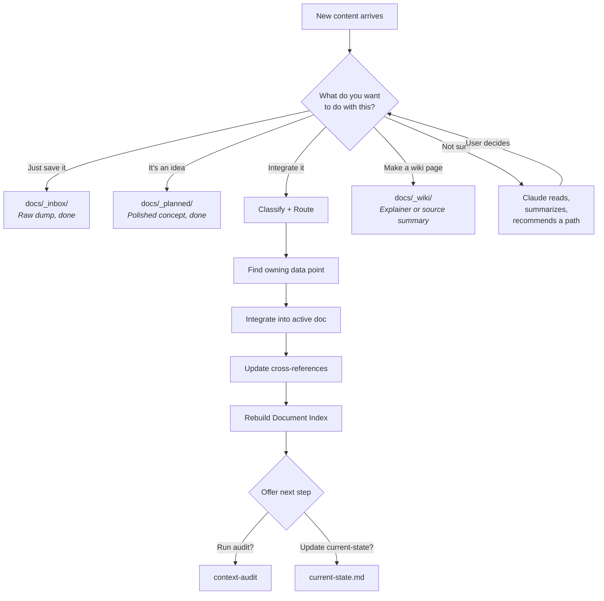

# Content Routing Architecture

How new content enters, flows through, and settles into the right location in CLEAR Context OS. This document covers the mechanics -- for the business rationale behind folder zones and ownership, see `docs/_bcos-framework/architecture/system-design.md`.

---

## The Single Entry Point

**`context-ingest` is the ONE skill for all new content. No exceptions.**

Whether the input is a pasted paragraph, a URL, a PDF, meeting notes, or a verbal update ("we decided to pivot to enterprise"), it enters through `context-ingest`. This single entry point guarantees that every piece of knowledge gets triaged, classified, and routed before it touches the context architecture.

For the full skill specification, see `.claude/skills/context-ingest/SKILL.md`.

---

## The Triage Decision Tree

Every ingest begins with one question: **"What do you want to do with this?"**



### Path 1: Inbox Dump

**Trigger:** "Just save this" / "Dump it" / "I'll deal with it later"

The content is saved as-is to `docs/_inbox/` with a descriptive filename and a minimal header (source, date, deposited-by). No frontmatter. No processing. No classification. Done.

**Output:** `docs/_inbox/meeting-2026-04-06.md`

### Path 2: Planned Deposit

**Trigger:** "This is an idea" / "Might do this someday" / "Park it"

The core concept is extracted and written as a clean document in `docs/_planned/` using relaxed frontmatter (status: draft, linking optional). Includes a "Why This Matters" section and open questions.

**Output:** `docs/_planned/enterprise-tier.md`

### Path 3: Full Integration

**Trigger:** "Integrate this" / "Update our context" / "This is real now"

Proceeds through the full classify-route-integrate pipeline (Steps 2-6 below). This is the only path that touches active data points in `docs/`.

### Path 4: Triage Assist

**Trigger:** "Not sure where this goes"

Claude reads the content, shows a summary and its recommendation (inbox / planned / integrate), and the user decides. Then follows the chosen path.

### Path 5: Collection

**Trigger:** "I have a bunch of similar files" / uploading call transcripts, reports, invoices, contracts, brand kits in bulk

Collections are for **immutable evidence artifacts** that don't fit the data point model — invoices, signed agreements, brand kits, transcripts, exports. The file IS the truth; editing it corrupts evidence. They need a zone with three properties: immutable, inventoried, linked back to data points.

**Where they go:** `docs/_collections/[type]/`

```
docs/_collections/
  call-transcripts/
  invoices/
  contracts/
  brand-kits/
  statements/
  wiki-source-docs/   # binary docs ingested via _wiki/ Path C
```

**Required per-subdirectory manifest:** every collection subdirectory carries a required `_manifest.md` with one row per file, BCOS frontmatter, and bidirectional links to active data points. We *manifest the directory, don't try to manifest the files* — because PDFs and zips can't carry frontmatter.

For the full schema, sidecar pattern, soft-delete mechanism, scanning job, and integration rules, see [`collections-zone.md`](./collections-zone.md).

**File naming:**

- **Never rename user files.** If someone uploads `Acme Q3 Review.pdf`, keep that name.
- **Soft convention** (suggested, not enforced): `YYYY-MM-DD_<descriptor>.<ext>`. The `collections-scan` job reports violations as INFO, never WARN.
- **Filename length:** under 100 characters to avoid cross-platform issues.

**What makes collections different from `_inbox/` and `_wiki/`:**

| | `_inbox/` | `_collections/` | `_wiki/` |
|---|---|---|---|
| **Purpose** | Temporary triage | Permanent immutable evidence | Derivative explanation |
| **Lifecycle** | Processed and removed | Stays and grows; soft-archive when superseded | Reviewed periodically; archived when stale |
| **Metadata** | None required | Required `_manifest.md` per subdirectory + optional sidecar `.meta.md` | Full BCOS frontmatter on every page |
| **Volume** | Small | Large (dozens to hundreds) | Moderate, curated |
| **Editable?** | Yes (raw text) | **No** — files are immutable evidence | Yes (the page; raw captures are immutable) |

**How Claude searches collections:** at session start, the wake-up snapshot includes a one-line summary per collection (file counts, expiring-soon flags) computed from manifest frontmatter. For deeper retrieval, Claude reads `_manifest.md` first — never opens binary files unless the query specifically demands it. Filename Glob remains free (`Glob("docs/_collections/call-transcripts/2026-04-*")`) for date-bracketed lookups.

### Path 6: External Reference

**Trigger:** Content lives in an external system (Google Drive, Notion, Confluence, Dropbox) and is either too large to copy or better managed where it is.

Don't clone external collections into the repo. Instead, create a reference data point that teaches Claude WHERE to find things and HOW to access them.

**When to map vs. copy:**

| Situation | Action |
|---|---|
| A few key docs (brand guide, strategy doc, 1-5 files) | Fetch via MCP, integrate locally as normal data points |
| A large collection (100+ call transcripts, invoices, reports) | **Map** — create an external reference, don't copy |
| Living documents that change frequently in the external system | **Map** — keep the source of truth external, reference it |
| Historical archives rarely accessed | **Map** — no point copying, just know where they are |

**The external reference data point** describes the system, path, format, volume, access method, and when to fetch. See `context-onboarding` Step 2c (map mode) for the full template.

**How Claude uses external references:** When a query might need data from an external collection, Claude reads the reference data point first. It learns: what's available, how to search for it, and which MCP tool to use. Then it fetches only what's needed for the specific query — not the entire collection.

### Path 7: Wiki Promotion

**Trigger:** "Make this a wiki page" / "Turn this into an explainer" /
"Promote this inbox item to wiki" / URL or local material should become a
source summary.

Wiki promotion is for derivative explanation, not canonical reality. The page
can summarize, teach, compare, narrate, or preserve source context, but it must
link back to active data points using `builds-on:` when it depends on current
business facts.

**Where it goes:**

| Source | Command | Destination |
|--------|---------|-------------|
| Existing file under `docs/_inbox/` | `/wiki promote <path>` | `docs/_wiki/pages/` or `docs/_wiki/source-summary/` |
| Direct upload, local file, paste, or URL | `/wiki create <source>` | `docs/_wiki/pages/` or `docs/_wiki/source-summary/` |
| URL to fetch later | `/wiki queue add <url>` | `docs/_wiki/queue.md` |

For the full command surface and schema rules, see
`.claude/skills/bcos-wiki/SKILL.md` and [`wiki-zone.md`](./wiki-zone.md).

**Boundary with collections:** Path B binaries stay inside
`docs/_wiki/raw/local/`. Do not write wiki-promoted files to `_collections/`
unless the user explicitly asks for a collection operation.

---

## Temporal Classification

When the user chooses "integrate," a temporal check runs before content touches active docs. Language signals determine the destination.

| Signal in the content | Destination | Rationale |
|----------------------|-------------|-----------|
| "We currently...", "Our pricing is...", "We serve..." | Active docs (`docs/`) | Describes present reality |
| "We plan to...", "Next quarter...", "We're considering..." | `docs/_planned/` | Future state -- not yet real |
| "We used to...", "Previously...", "Before the pivot..." | `docs/_archive/` or Context section of active doc | Historical -- may inform but is not current |

**Critical rule:** Future-state content must never be merged into an active document without explicit user confirmation. A plan to offer enterprise pricing is not the same as currently offering enterprise pricing.

---

## Ownership Routing

Once content is classified by type and temporality, it needs an owner. The ownership specification is the traffic cop.

### The Routing Algorithm

```
1. READ the content -- what kind of knowledge is it?

   Content Type              Route To
   -------------------------+---------------------------------
   Company identity, values  | Company/identity data points
   Customer info, segments   | Audience data points
   Product/service changes   | Product/value data points
   Process changes           | Process documents
   Market shifts, competitor | Market/competitive data points
   Policy changes            | Policy documents
   New facts, reference data | Reference documents
   Strategic decisions       | Strategy data points

2. CHECK existing data points -- does one EXCLUSIVELY_OWN this topic?
   - Read the EXCLUSIVELY_OWNS section of candidate data points
   - If a clear owner exists --> route there

3. CHECK STRICTLY_AVOIDS -- make sure you are not routing to the wrong place
   - If data point X says "STRICTLY_AVOIDS competitor analysis"
     --> do NOT put competitor info there, even if it seems related

4. NO OWNER FOUND? --> Recommend creating a new data point
   - Suggest a name, cluster, and initial DOMAIN
   - Use the template from docs/templates/context-data-point.md
```

### When Content Spans Multiple Types

If a single source contains multiple types of knowledge (e.g., a strategy deck with audience data, competitive analysis, and pricing changes), split it and route each piece to its owner separately. One source can update multiple data points.

---

## Contradiction Handling

When new content conflicts with existing content in a data point, `context-ingest` never silently overwrites.

### The Five Resolution Paths

| Scenario | Action |
|----------|--------|
| User confirms new version is correct | Update the data point. Note the change in changelog. |
| User says "keep both" | Note the contradiction in the Context section as a known tension. |
| User is unsure | Set `status: under-review` on the data point. Flag for later resolution. |
| New content is clearly more recent | Present both versions. Ask user to confirm before updating. |
| Conflict is between two active docs | Identify which document OWNS the topic. Consolidate there. Remove from the other. |

**The principle:** Present both versions. Let the user decide. Never assume the new version is automatically correct -- the existing content may be deliberately different.

---

## Cross-Reference Cascade

Integrating content into one data point can trigger downstream effects. After every integration, `context-ingest` checks for cascade impacts.

### What Gets Checked

```
After updating [data-point-X]:

1. PROVIDES relationships
   - Does data-point-X provide input to other docs?
   - If market-context changed --> competitive-positioning may need review

2. BUILDS_ON relationships (reverse check)
   - Do other docs build on data-point-X?
   - If audience changed --> messaging and value-prop may need review

3. REFERENCES relationships
   - Are cross-references still accurate?
   - Update BUILDS_ON / REFERENCES / PROVIDES if new connections emerged
```

### What Gets Updated

| Artifact | Update |
|----------|--------|
| Affected data point | Version bump, `last-updated` set to today |
| Ownership spec | New BUILDS_ON / REFERENCES / PROVIDES entries if relationships emerged |
| Document Index | Add source to "Knowledge Sources Found"; update coverage assessment |

---

## Automatic Handoffs

After ingest completes, three handoffs occur. The first is automatic; the other two are offered.

| # | Handoff | Trigger | Automatic? |
|---|---------|---------|------------|
| 1 | Rebuild Document Index | Always | Yes -- runs `python .claude/scripts/build_document_index.py` |
| 2 | Update `current-state.md` | If the ingested content is significant | Offered -- "Want me to update What Changed Recently?" |
| 3 | Run CLEAR audit | If a new data point was created | Offered -- "Want me to run a quick CLEAR audit on the new doc?" |

---

## File Movement Between Zones

Documents move between zones as their status changes. Each transition has different requirements.

```
  _inbox/                docs/                _planned/             _archive/
  (raw material)         (active context)     (polished ideas)      (superseded)
       |                      ^                     |                    ^
       |                      |                     |                    |
       +----> refine ---------+                     |                    |
       |                      |                     |                    |
       +----> polish -------->|--- _planned/ -------+                    |
                              |                     |                    |
                              |     promote --------+                    |
                              |                                          |
                              +----> supersede -------------------------+
```

### Transition Requirements

| Transition | What happens | Requirements |
|-----------|-------------|--------------|
| `_inbox/` --> `docs/` | Raw material refined into active context | Full frontmatter. Ownership spec. CLEAR compliance. Run through context-ingest Steps 2-6. |
| `_inbox/` --> `_planned/` | Raw idea polished into a documented concept | Frontmatter recommended. Linking optional. Clean up into concept + rationale + open questions. |
| `_planned/` --> `docs/` | Idea becomes reality | Build full ownership spec. Define all relationships (BUILDS_ON, REFERENCES, PROVIDES). Set `status: active`. This is the heaviest transition -- the document needs to meet the same bar as any active data point. |
| `docs/` --> `_archive/` | Superseded by newer version or no longer relevant | Set `status: archived`. Do NOT delete. Check what BUILDS_ON this document and update those references. |

### What Never Moves Backward

- Active docs (`docs/`) never move to `_inbox/`. If they need rework, set `status: under-review`.
- Archived docs (`_archive/`) never move back to active without going through the full integration path. History does not un-happen -- if the old content is relevant again, create a new version.

---

## Ingest Summary Format

Every completed ingest produces a summary report:

```
## Ingest Summary

**Source:** [what was ingested]
**Date:** [today]

### Updates Made
- [data-point-name] (v1.2.0 -> v1.3.0): Added [what]
- [data-point-name] (v2.0.1 -> v2.0.2): Updated [what]

### Contradictions Found
- [data-point]: new info says X, existing says Y -> [resolved/flagged]

### New Data Points Recommended
- [suggested name]: [why needed]

### Cross-References Updated
- [data-point-A] now REFERENCES [data-point-B]

### Document Index
- [Updated / No changes needed]
```

This summary is the audit trail. It shows exactly what changed, what conflicted, and what still needs attention.
