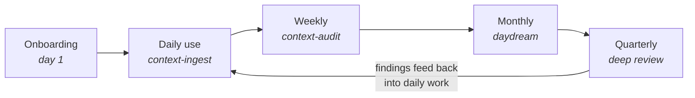
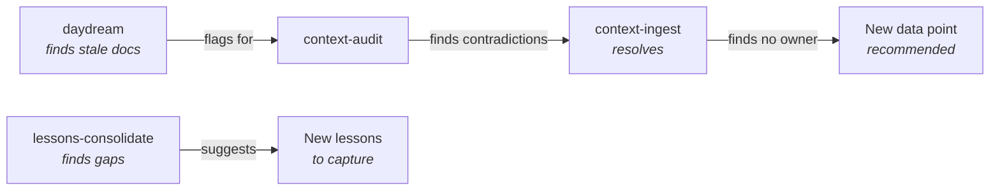

# Maintenance Lifecycle -- How BCOS Stays Healthy

Context dies from neglect, drift, accumulation, ownership vacuums, and change blindness. The maintenance lifecycle is the defense system: layered checks at increasing time horizons that catch problems before they compound.

---

## The Core Loop



Each pass through the loop catches what the previous layer missed. The cycle repeats indefinitely -- there is no "done" state for maintenance.

---

## Maintenance Phases

Phase selection depends on how fast context is changing, not how old the project is. A mature project entering a new market drops back to Building.

### Building Phase (New Project)

First 1-2 months. Adding data points frequently. Architecture is still forming.

| Task | Frequency | Implementation |
|------|-----------|----------------|
| Document Index rebuild | Daily | `python .claude/scripts/build_document_index.py` |
| Quick health check | Weekly | `context-audit` -- boundary violations, broken refs, naming drift |
| Lessons capture | Weekly | Capture what worked, what confused |

**Skip:** Daydream (too early to reflect), deep audit (not enough content), quarterly review.

### Active Phase (Growing)

3-6 months in. Editing more than creating. Architecture taking shape.

| Task | Frequency | Implementation |
|------|-----------|----------------|
| Document Index rebuild | Weekly | `build_document_index.py` |
| Health check | Weekly | `context-audit` -- CLEAR audit + metadata validation |
| Daydream | Bi-weekly | `daydream` -- strategic reflection on gaps and relevance |
| Deep audit + lessons | Monthly | Full cluster audit, `lessons-consolidate`, repo re-scan |

### Steady Phase (Mature)

6+ months. Rare structural changes. Maintenance prevents silent drift.

| Task | Frequency | Implementation |
|------|-----------|----------------|
| Document Index rebuild | Bi-weekly | `build_document_index.py` |
| Health check | Bi-weekly | `context-audit` -- lighter touch, staleness focus |
| Daydream | Monthly | `daydream` -- architecture still aligned with reality? |
| Deep audit + lessons | Quarterly | Full architecture review across all data points |

### Migration Phase (Consolidating)

Consolidating existing chaos into CLEAR structure. Burst activity for 1-3 weeks, then transition to Active.

| Task | Frequency | Implementation |
|------|-----------|----------------|
| Document Index rebuild | Daily | Track progress as docs get formalized |
| Quick health check | Every 2-3 days | Catch contradictions between migrated and unmigrated docs |
| Progress review | Weekly | How many migrated? What remains? |

**Transition signal:** When unmanaged docs reach zero, switch to Active rhythm.

---

## What Triggers What

### Automatic Triggers (Hooks)

Write-time validation catches issues at the moment of creation:

- Edit/Write to `docs/*.md` fires frontmatter validation
- Hook warns about missing or invalid metadata fields
- Claude self-corrects before the file is committed

This is the fastest feedback loop -- problems caught in seconds, not days.

### Scheduled Triggers (Dispatcher)

From v1.2 onward, BCOS installs a **single scheduled task per repo** — `bcos-{project}` — that runs daily and acts as a dispatcher. It reads `.claude/quality/schedule-config.json` to decide which maintenance jobs are due today, runs them in sequence, and produces one consolidated digest at `docs/_inbox/daily-digest.md`.

Five jobs, one dispatch:

| Job                   | Default cadence | Purpose                                                        |
|-----------------------|-----------------|----------------------------------------------------------------|
| `index-health`        | daily           | Rebuild index; structural scan; apply whitelisted auto-fixes   |
| `daydream-lessons`    | Mon             | Weekly operational reflection + lessons capture                |
| `daydream-deep`       | Wed             | Deeper structural reflection (splits, merges, retirements)     |
| `audit-inbox`         | Fri             | Light CLEAR audit across all clusters + inbox aging + lessons triage |
| `architecture-review` | 1st             | Full audit + ecosystem drift + health score + 3 priorities     |

Every dispatcher run writes one diary line per job to `.claude/hook_state/schedule-diary.jsonl` — an append-only, gitignored history that the dispatcher reads to generate frequency-tuning suggestions (never auto-applies them).

**Why one task, not five:** user-global scheduled tasks collided when users ran BCOS across multiple repos, named checks were running daily despite "weekly" labels, and five separate morning reports created a UX mess. One task, one digest, one config file — changes happen in natural language through the `schedule-tune` skill.

> **Implementation:** See `docs/_bcos-framework/guides/scheduling.md` for the full dispatcher model, config schema, and natural-language tuning examples.

### Event-Driven Triggers

Business changes that should prompt immediate context review:

| Event | Action | Affected Data Points |
|-------|--------|---------------------|
| New product launch | Update via `context-ingest` | Value prop, product description, messaging, audience, competitive landscape |
| Competitor shift | Update competitive context | Competitive landscape, value prop, messaging, market context |
| Team restructure | Reassign ownership | All ownership assignments, cluster leads |
| New market entry | Create market-specific context | Market context, audience, competitive landscape, messaging |
| Rebrand | Cascade from brand identity outward | Brand identity, voice, messaging, visual identity, value prop |

> **Implementation:** See `docs/_bcos-framework/guides/maintenance-guide.md` for full trigger-to-data-point mapping.

### Cascade Triggers

Maintenance tasks that spawn follow-up work:



No maintenance task operates in isolation. Each one feeds the others.

---

## The Daydream Cycle (Deep Dive)

Daydream is the strategic reflection layer. It asks: "Is our context architecture still aligned with reality?"

> **Implementation:** `.claude/skills/daydream/SKILL.md`

### How It Knows What Changed

1. Reads `.claude/quality/last-daydream.txt` for last run timestamp
2. Runs `git log --since={date}` scoped to `docs/` only
3. Excludes framework directories: `methodology/`, `guides/`, `templates/`, `architecture/`
4. For each changed file, reads the actual `git diff` (not just the file list)
5. Checks for new or disappeared files via `build_document_index.py --dry-run`
6. Reads `current-state.md` and `table-of-context.md` for human signals

### Four-Phase Process

| Phase | Duration | Focus |
|-------|----------|-------|
| 1. What Changed | 5 min | Git diffs, new/disappeared files, context layer signals |
| 2. Reflect | 10 min | Why did things change? Ripple effects? Missing updates? Folder zone health |
| 3. Imagine | 10 min | New team member test, new market test, 6-month vision, `_planned/` review |
| 4. Capture | 5 min | Promote `_planned/` to active, clean `_inbox/`, archive stale, update context layers |

### Short-Circuit

If nothing changed since last run, skip directly to Phase 3 (Imagine) for forward-looking reflection only. The git diff check makes this decision automatic.

### Timestamp Tracking

After Phase 4 completes, the run date is written to `.claude/quality/last-daydream.txt`. The next daydream picks up exactly where this one left off. If the file does not exist (first run), daydream uses 2 weeks ago as baseline.

---

## The Audit Cycle (Deep Dive)

Context-audit is the structural integrity layer. It checks whether documents follow CLEAR principles and flags violations by severity.

> **Implementation:** `.claude/skills/context-audit/SKILL.md`

### Severity Levels

| Level | Meaning | Example | Action Timeline |
|-------|---------|---------|-----------------|
| CRITICAL | System integrity at risk | Missing YAML frontmatter entirely | Fix immediately |
| HIGH | Quality degradation | Missing required fields, duplication causing divergence | Fix this sprint |
| MEDIUM | Attention needed | Stale `last-updated` (>90 days active, >180 days planned) | Fix when in area |
| LOW | Informational | Missing optional fields, incomplete `_planned/` cross-refs | Nice to have |

### What Gets Checked

**Metadata completeness** -- 7 required fields per document:
- `name`, `type`, `cluster`, `version`, `status`, `created`, `last-updated`

**CLEAR compliance** -- 5 audit categories:

| Category | Checks For |
|----------|-----------|
| Contextual Ownership | Multiple owners for same content, unclear responsibility, orphaned content |
| Linking | Duplicated information across data points, copy-paste, inconsistent cross-references |
| Elimination | Same content in multiple places, redundant data points, repeated hardcoded values |
| Alignment | Naming inconsistency, format differences, structure inconsistency |
| Refinement | Overly complex data points, vague language, missing maintenance metadata |

**Folder zone compliance:**
- `docs/_planned/` docs older than 6 months: promote to active or archive
- Active docs depending on `_planned/` docs: flagged as forward-looking dependency
- `docs/_inbox/` files: skipped (raw material, no quality bar)
- `docs/_archive/` files: skipped or reported separately

**Technical debt:** `TODO`, `FIXME`, `OUTDATED`, `DEPRECATED` markers across all scoped files.

### Priority Matrix

Every finding is scored: Priority = (Impact x Frequency) / (Effort x Risk), then placed into quadrants:

- **Quick Wins** (high value, low effort) -- do first
- **Big Wins** (high value, high effort) -- plan carefully
- **Low Priority** (low value, low effort) -- do when convenient
- **Avoid** (low value, high effort) -- not worth it

---

## The Lessons System

Institutional knowledge compounds over time through the lessons system.

> **Implementation:** `.claude/skills/lessons-consolidate/SKILL.md`

### How Knowledge Compounds

1. Skills capture lessons in `.claude/quality/ecosystem/lessons.json` during normal work
2. Each lesson carries tags (CLEAR methodology tags + operational tags)
3. `lessons-consolidate` runs periodically to maintain collection health

### Three Consolidation Modes

| Mode | What It Does | Detects |
|------|-------------|---------|
| Staleness check | Are lessons still relevant? | Referenced concepts that no longer exist |
| Overlap detection | Are multiple lessons saying the same thing? | Redundant lessons, contradictions |
| Gap analysis | What situations have no lessons? | Under-represented tags, uncovered topics |

### Consolidation Actions

- **Stale lessons:** Archived (not deleted) -- moved to archived section
- **Overlapping lessons:** Merged into single stronger lesson
- **Contradictions:** Flagged for user resolution
- **Gaps:** New lessons suggested for uncovered areas

### Trigger Frequency

Monthly, or every 10-15 sessions, whichever comes first. If `lessons.json` feels cluttered, run sooner.

---

## Scaling the Maintenance Rhythm

As context grows, increase maintenance frequency. Larger architectures have more surface area for drift.

| Context Size | Index Rebuild | Audit | Daydream | Deep Review |
|-------------|--------------|-------|----------|-------------|
| < 20 docs | Weekly | Monthly | Monthly | Quarterly |
| 20-50 docs | Weekly | Bi-weekly | Monthly | Quarterly |
| 50-100 docs | Daily | Weekly | Bi-weekly | Monthly |
| 100+ docs | Daily | Weekly | Weekly | Monthly |

**Adjustment signals:**

- 3 consecutive checks find nothing: reduce frequency by half
- Finding stale content regularly: increase frequency
- Business changing faster than context: increase frequency
- Scheduled tasks feel like noise: reduce frequency

---

## The Self-Healing Pattern

BCOS layers four defenses at increasing time horizons. Each catches what the previous one missed.

```
Layer 1: Hooks (immediate)
  |  Catches: missing frontmatter, invalid metadata at write-time
  |
Layer 2: Scheduled audits (weekly)
  |  Catches: drift, boundary violations, broken cross-references
  |
Layer 3: Daydream (monthly)
  |  Catches: strategic misalignment, stale plans, missing connections
  |
Layer 4: Deep review (quarterly)
     Catches: architectural issues, ownership gaps, completeness problems
```

The pattern is deliberately redundant. A frontmatter issue caught by a hook never reaches the audit layer. A drift issue caught by the audit never reaches daydream. But if something slips through one layer, the next one picks it up.

The goal is not zero findings at any layer. The goal is **no surprises** -- issues are small and expected, not large and alarming.

### Derived Artifacts vs. Authored Truth

A second, related principle: **state files that mirror disk should be regenerated, not authored.**

`.claude/quality/ecosystem/state.json` is an inventory — it records which skills, agents, and utilities exist. The disk is the source of truth (which directories have `SKILL.md`, which have `AGENT.md`, which have neither). The file just records what discovery found.

When a derived file is treated as authored truth and edited by hand, drift is inevitable. The file falls out of sync with disk the moment someone adds a directory and forgets to update the JSON. By the time the monthly architecture-review notices, the gap is large enough to be alarming.

The fix is to refresh the file from disk on a regular cadence — daily via `index-health` and at every framework update via `update.py`. The mechanism is the `ecosystem-state-refresh` auto-fix, governed by the same safety rules as every other whitelisted fix (deterministic, idempotent, no business-content change, reversible by `git diff`).

This principle generalizes: any registry, cache, or inventory file that mirrors a queryable source (disk, a database, an API) should follow the same pattern. The framework's `lessons.json` is the counter-example — it IS authored truth, and is therefore explicitly excluded from auto-refresh and only changed via the `lessons-consolidate` skill.

See lesson `L-INIT-20260404-009`: *"Discovery scripts are the source of truth for what exists. State files record what discovery found, not the definition itself."*

---

## References

| Resource | Path | Purpose |
|----------|------|---------|
| Scheduling guide | `docs/_bcos-framework/guides/scheduling.md` | Dispatcher model, config schema, natural-language tuning |
| Maintenance guide | `docs/_bcos-framework/guides/maintenance-guide.md` | User-facing maintenance rhythm and triggers |
| Schedule dispatcher | `.claude/skills/schedule-dispatcher/SKILL.md` | The single-task dispatcher that coordinates all jobs |
| Schedule tune | `.claude/skills/schedule-tune/SKILL.md` | Natural-language config editor |
| Daydream skill | `.claude/skills/daydream/SKILL.md` | 4-phase reflection process |
| Context-audit skill | `.claude/skills/context-audit/SKILL.md` | CLEAR compliance checks and severity levels |
| Lessons-consolidate skill | `.claude/skills/lessons-consolidate/SKILL.md` | Knowledge compounding and cleanup |
| Document Index script | `.claude/scripts/build_document_index.py` | Automated index rebuild |
