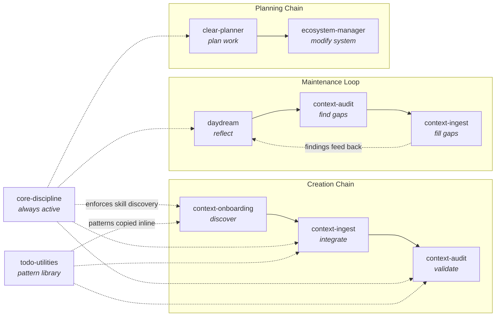

# System Design -- CLEAR Context OS

## Overview

CLEAR Context OS (BCOS) is a framework that turns a Git repository into a living knowledge base managed by Claude Code. It layers a skill/agent/hook system on top of structured Markdown documents so that organizational knowledge stays accurate, bounded, and discoverable across sessions. The architecture separates *what the business knows* (docs/) from *how that knowledge is maintained* (.claude/), with CLAUDE.md acting as the bootstrap that wires them together at session start.

---

## The Three Layers

BCOS is built on three distinct layers, each with a different rate of change and a different audience.

| Layer | Location | Purpose | Changes |
|-------|----------|---------|---------|
| **User content** | `docs/` | Active data points, raw material, ideas, archive | Every session |
| **Framework** | `.claude/` | Skills, agents, hooks, scripts, quality infra | Rarely -- only when the system evolves |
| **Bootstrap** | `CLAUDE.md` | What Claude reads first; session start protocol | When navigation or rules change |

**User content** is the business itself: brand identity, audience definitions, competitive landscape, pricing models. This is what people maintain day to day.

**Framework** is the machinery: the skills that know how to ingest, audit, and reflect; the agents that scan files without filling the context window; the hooks that enforce frontmatter on every edit; the scripts that rebuild indexes.

**Bootstrap** is the handshake. CLAUDE.md tells Claude where things live, what rules to follow, and which files to read first. It is the single entry point for every session.

---

## Folder Zones

Documents live in four zones. The zone tells Claude what the content IS before the file is opened.

```
docs/
  *.md            Active context -- current business reality
  _inbox/         Raw material -- meeting notes, brain dumps, unprocessed
  _planned/       Polished ideas -- documented but not yet real
  _archive/       Superseded -- was real once, kept for reference
```

| Zone | Trust level | Quality bar |
|------|-------------|-------------|
| `docs/*.md` | High -- act on it | Full CLEAR compliance |
| `docs/_inbox/` | Low -- needs processing | None (no frontmatter required) |
| `docs/_planned/` | Read, not current reality | Frontmatter recommended, linking optional |
| `docs/_archive/` | Historical reference only | As-was when archived |

**The principle: path IS the signal.** When a search returns `docs/_planned/enterprise-pricing.md`, the path alone communicates that this is an idea, not reality. A status field buried in YAML frontmatter is easy to miss once content is already in the context window. The folder makes it impossible to miss.

For the full folder structure specification, see `docs/methodology/document-standards.md`.

---

## The Skill Graph

BCOS has 10 skills organized into two tiers. Skills are instructions stored in `.claude/skills/{name}/SKILL.md` that Claude follows when a specific type of work is needed.

### Tier 1 -- Foundation (always active or frequently invoked)

| Skill | What it does |
|-------|-------------|
| `context-onboarding` | First-run scan; produces the Document Index |
| `context-ingest` | Single entry point for all new content |
| `core-discipline` | Always-on overlay; enforces skill discovery before every action |
| `doc-lint` | Markdown quality validation |

### Tier 2 -- Operational (invoked for specific workflows)

| Skill | What it does |
|-------|-------------|
| `clear-planner` | Implementation planning with session tracking |
| `context-audit` | CLEAR compliance auditing |
| `daydream` | Strategic reflection on the context architecture |
| `ecosystem-manager` | Agent/skill ecosystem maintenance |
| `lessons-consolidate` | Institutional knowledge maintenance |

### Reference (not invoked, only referenced)

| Skill | What it does |
|-------|-------------|
| `todo-utilities` | Shared TodoWrite patterns copied inline by other skills |

### How Skills Relate

Skills form three natural chains:



**core-discipline** sits across everything. It is not a step in a chain -- it is an always-active overlay that checks whether a relevant skill applies before any action is taken. It enforces the compounding rule (see below) and matches overhead to task size: small changes get no ceremony, significant changes get the full workflow.

**todo-utilities** is a pattern library, not a callable skill. Other skills copy its TodoWrite patterns inline rather than invoking it, because a sub-agent's TodoWrite calls would not be visible in the main context window.

For the full skill specifications, see `.claude/skills/{name}/SKILL.md`.

---

## The Agent Model

BCOS has one agent: **explore**.

| Property | Value |
|----------|-------|
| Name | `explore` |
| Mode | Read-only |
| Invoked by | Any skill, or manually |
| Can invoke | Nothing -- no skills, no other agents |

### The Architectural Constraint

**Skills spawn agents. Agents cannot spawn agents.**

This is deliberate. Orchestration (deciding what to do, resolving contradictions, making triage decisions) requires the main context window where Claude reasons and the user interacts. Heavy reading (scanning 50 files for frontmatter, searching all docs for a keyword) needs isolation so it does not fill that main window.

The explore agent runs in its own context window, reads files, and returns compact summaries. The main session never loads the raw file content -- it only sees the summary.

### When to Delegate

| Task | Main window | Delegate to explore |
|------|-------------|---------------------|
| Read 1-3 specific files | Yes | |
| Scan a directory for patterns | | Yes |
| Search across all docs | | Yes |
| Audit 20+ documents | | Yes |
| Synthesize findings | Yes | |
| Write or update a data point | Yes | |

**Rule of thumb:** If a task involves reading more than 5 files or scanning a directory, delegate it.

For the full agent specification, see `.claude/agents/explore/AGENT.md`.

---

## The Hook Model

Hooks are automated checks that run after Claude uses specific tools. They are configured in `.claude/settings.json`.

### Current Hooks

| Trigger | Tool | What it does |
|---------|------|-------------|
| PostToolUse | `Edit` | Runs `post_edit_frontmatter_check.py` -- validates YAML frontmatter |
| PostToolUse | `Write` | Same frontmatter check |

### Philosophy: Warn, Don't Block

Hooks produce warnings, not errors. If frontmatter is missing or malformed, the hook tells Claude what is wrong. Claude then fixes it. The hook does not prevent the edit from being saved.

This keeps the workflow fluid while enforcing standards. The human sees the warning in the conversation and can override if needed.

### Adding a New Hook

1. Write a Python script in `.claude/hooks/` that exits 0 (pass) or non-zero (warning)
2. Add an entry to `.claude/settings.json` under `hooks.PostToolUse`
3. Specify the `matcher` (which tool triggers it), `command`, `timeout`, and `statusMessage`

```json
{
  "matcher": "Edit",
  "hooks": [{
    "type": "command",
    "command": "python \"$CLAUDE_PROJECT_DIR/.claude/hooks/your_check.py\"",
    "timeout": 10,
    "statusMessage": "Running your check..."
  }]
}
```

---

## The Script Model

Scripts handle work that does not belong in Claude's context window -- bulk file processing, pattern searching, and index generation. They are plain Python files in `.claude/scripts/`.

| Script | What it does | When to run |
|--------|-------------|-------------|
| `build_document_index.py` | Scans all docs, extracts frontmatter, generates `docs/document-index.md` | After any ingest or structural change |
| `find_lessons.py` | Searches lessons.json by tags, keywords, or date | When looking for institutional knowledge |
| `consolidate_lessons.py` | Analyzes lessons for staleness, overlaps, and gaps | Periodic maintenance |

**Why Python, not Claude?** These scripts process every file in the repo. Running them as Python keeps the context window free for thinking. Claude invokes them via Bash, reads the output, and acts on it.

---

## Session Bootstrap

Every session starts the same way. Claude reads three files in order:

```
1. docs/table-of-context.md   -- The business: who we are, what we do, market position
                                  Stable. Updated monthly.

2. docs/current-state.md       -- The operator: priorities this week, active decisions
                                  Fluid. Updated weekly.

3. docs/document-index.md      -- The inventory: what files exist, metadata health
                                  Auto-generated by script.
```

Together these give Claude the full picture without reading every data point. Claude drills into specific data points only when detail is needed for the task at hand.

This three-file bootstrap means Claude starts every session with the same shared understanding of the business, regardless of what was discussed in previous sessions.

---

## The Compounding Rule

This is the single most important design principle in BCOS.

**Every significant task produces TWO outputs:**

1. **The deliverable** -- the answer, analysis, or recommendation the user asked for
2. **Context updates** -- updates to the relevant data points so the knowledge persists

Without this rule, knowledge evaporates into chat history. A brilliant competitive analysis disappears when the session ends. A pricing decision discussed for 30 minutes lives only in a transcript nobody will re-read.

With this rule, every conversation makes the context architecture richer. The system compounds.

The rule is enforced by `core-discipline`, which monitors all work and prompts: "This analysis affects [data point]. Want me to update it with the new insight?" See `.claude/skills/core-discipline/SKILL.md` for the full specification.

---

## Context Window Management

The context window is a finite resource. Reading 50+ documents in a single session fills it before the real work starts.

**Main window = thinking and deciding. Agents = reading and scanning.**

### Scaling Strategy

| Context size | Strategy |
|-------------|----------|
| < 20 docs | No delegation needed. Everything fits in the main window. |
| 20-50 docs | Delegate full scans (onboarding, audit). Keep targeted reads in main. |
| 50-100 docs | Delegate ALL bulk reads. Use explore agent for any multi-file operation. |
| 100+ docs | Run Python scripts for inventory. Agent-per-cluster for audits. Main window only for synthesis and decisions. |

### What Stays in the Main Window

Tasks that require judgment stay in the main window:

- Triage decisions (user interaction needed)
- Contradiction resolution (which version is correct?)
- Synthesis and reflection (the whole point of daydream)
- Plan creation (architecture decisions need full context)
- Cross-reference updates (need awareness of the whole graph)

For the full delegation model, see the Context Window Management section in `docs/methodology/context-architecture.md`.
