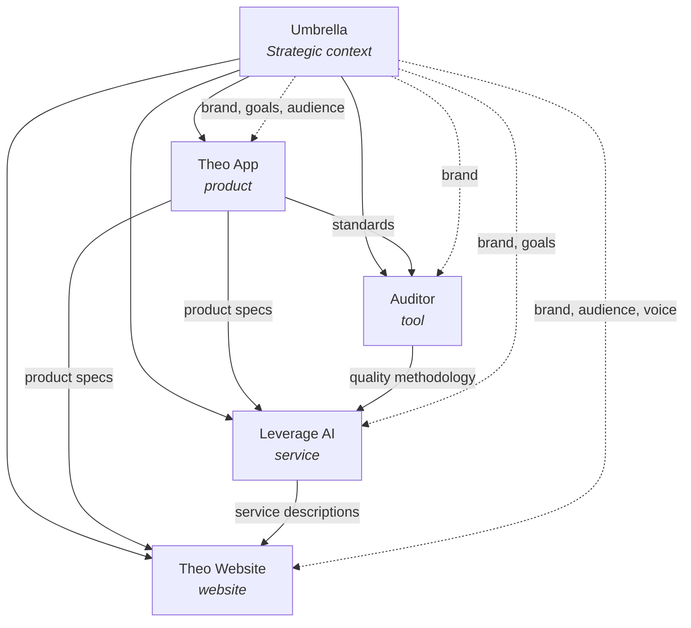

# Umbrella BCOS — Architecture

## Overview

Umbrella BCOS is a multi-project orchestration layer that sits above multiple standard BCOS installations ("nodes"). It provides cross-project context visibility, content routing, auditing, and strategic synthesis — without modifying the node BCOS framework.

**Core principle:** Nodes are 100% self-sufficient standalone. The umbrella adds a layer; it never modifies node behavior.

**Coupling mechanism:** A single detection file (`.bcos-umbrella.json`) dropped into each registered node. This is the entire interface between umbrella and node.

---

## The Three-Layer Model (Extended)

Standard BCOS has three layers (User Content, Framework, Bootstrap). Umbrella BCOS adds a fourth:

```
┌────────────────────────────────────────────────────┐
│  Layer 4: UMBRELLA                                 │
│  Cross-project synthesis, routing, orchestration   │
│  Lives in: umbrella repo root                      │
├────────────────────────────────────────────────────┤
│  Layer 3: BOOTSTRAP (per node)                     │
│  CLAUDE.md — session start protocol                │
├────────────────────────────────────────────────────┤
│  Layer 2: FRAMEWORK (per node)                     │
│  .claude/ — skills, agents, hooks, scripts         │
├────────────────────────────────────────────────────┤
│  Layer 1: USER CONTENT (per node)                  │
│  docs/ — data points, inbox, planned, archive      │
└────────────────────────────────────────────────────┘
```

The umbrella layer has its OWN Layers 1-3 (its own docs/, .claude/, CLAUDE.md) for umbrella-level context. It additionally orchestrates across all node instances.

---

## Directory Structure

```
umbrella-repo/
├── CLAUDE.md                           # Umbrella bootstrap
├── .claude/                            # Umbrella framework
│   ├── settings.json                   # Hooks (standard + cross-project)
│   ├── skills/
│   │   ├── project-navigator/          # Cross-project navigation + search
│   │   │   └── SKILL.md
│   │   ├── cross-project-audit/        # CLEAR audit across portfolio
│   │   │   └── SKILL.md
│   │   ├── cross-project-ingest/       # Route content across projects
│   │   │   └── SKILL.md
│   │   ├── portfolio-daydream/         # Strategic reflection across projects
│   │   │   └── SKILL.md
│   │   └── [standard BCOS skills]/     # Full node skill set for umbrella's own docs
│   ├── agents/
│   │   └── explore/                    # Standard (scans umbrella + nodes)
│   ├── hooks/
│   │   ├── [standard BCOS hooks]/
│   │   └── cross_project_ref_check.py  # Validates @project/ref syntax
│   ├── scripts/
│   │   ├── [standard BCOS scripts]/
│   │   ├── build_portfolio_index.py    # Aggregate indexes across projects
│   │   ├── sync_project_registry.py    # Keep registry current
│   │   └── generate_portfolio_wakeup.py
│   └── registries/
│       ├── entities.json               # Standard + project entities
│       ├── reference-index.json
│       └── projects.json               # Project catalog (see below)
│
├── docs/                               # Umbrella-level context
│   ├── .wake-up-context.md             # Cross-project compressed snapshot
│   ├── .session-diary.md
│   ├── table-of-context.md             # The BIG picture across all projects
│   ├── current-state.md                # Cross-project status
│   ├── document-index.md
│   ├── project-map.md                  # How projects interconnect (see below)
│   ├── [shared-data-points].md         # Brand identity, strategic goals, etc.
│   ├── _bcos-framework/
│   ├── _inbox/
│   ├── _planned/
│   ├── _archive/
│   └── _collections/
│
└── projects/                           # All child projects
    ├── leverage-ai/                    # Node (submodule or directory)
    │   ├── .bcos-umbrella.json         # Interface file (dropped by umbrella)
    │   ├── CLAUDE.md                   # Unchanged node bootstrap
    │   ├── .claude/                    # Unchanged node framework
    │   ├── docs/                       # Unchanged node context
    │   └── [source code]
    │
    ├── theo-app/
    │   ├── .bcos-umbrella.json
    │   └── [full node BCOS + source]
    │
    ├── auditor/
    │   ├── .bcos-umbrella.json
    │   └── [full node BCOS + source]
    │
    ├── theo-website/
    │   ├── .bcos-umbrella.json
    │   └── [full node BCOS + source]
    │
    └── engagements/
        ├── client-alpha/
        │   ├── .bcos-umbrella.json
        │   └── [node BCOS + deliverables]
        └── client-beta/
            └── ...
```

---

## The Node-Umbrella Interface

### .bcos-umbrella.json

This file is the **entire coupling** between umbrella and node. It is:
- **Created by** the umbrella when a node is registered
- **Placed in** the node's root directory
- **Read by** umbrella skills/scripts (always) and optionally by node skills
- **Removed** to fully disconnect a node (restores standalone behavior)

```json
{
  "$schema": "bcos-umbrella/v1",
  "umbrella": {
    "name": "Guntis Portfolio",
    "path": "../..",
    "version": "1.0.0"
  },
  "node": {
    "id": "leverage-ai",
    "registered": "2026-04-10",
    "role": "service"
  },
  "siblings": [
    { "id": "theo-app", "path": "../theo-app", "role": "product" },
    { "id": "auditor", "path": "../auditor", "role": "tool" },
    { "id": "theo-website", "path": "../theo-website", "role": "website" }
  ],
  "shared_context": {
    "inherits_from_umbrella": [
      "brand-identity",
      "strategic-goals",
      "target-audience"
    ],
    "provides_to_umbrella": [
      "service-offering",
      "engagement-methodology"
    ]
  }
}
```

### Field Reference

| Field | Purpose |
|-------|---------|
| `umbrella.name` | Display name for the umbrella instance |
| `umbrella.path` | Relative path from node root to umbrella root |
| `umbrella.version` | Umbrella BCOS version |
| `node.id` | This node's unique identifier |
| `node.registered` | When this node was registered |
| `node.role` | Node type: `service`, `product`, `tool`, `website`, `engagement` |
| `siblings` | Other registered nodes (id, relative path, role) |
| `shared_context.inherits_from_umbrella` | Umbrella data points this node can reference |
| `shared_context.provides_to_umbrella` | Node data points the umbrella synthesizes from |

### Detection Pattern

```python
import os, json

def detect_umbrella(project_dir=None):
    """Check if this node is under an umbrella. Returns config or None."""
    root = project_dir or os.environ.get('CLAUDE_PROJECT_DIR', '.')
    marker = os.path.join(root, '.bcos-umbrella.json')
    if os.path.exists(marker):
        with open(marker) as f:
            return json.load(f)
    return None
```

This pattern supports two operational modes (decision deferred):

**Mode A — "Umbrella owns it all":**
Nodes never read `.bcos-umbrella.json`. The file exists only for umbrella scripts to know which nodes are registered. Node skills are completely unchanged.

**Mode B — "Nodes with optional hooks":**
Node skills optionally check for `.bcos-umbrella.json`. If present:
- `context-audit` can show cross-project references in results
- `context-ingest` can suggest routing to sibling projects
- `generate_wakeup_context.py` can include umbrella context in wake-up

The architecture supports both. Mode A is the starting point; Mode B can be added later without breaking anything.

---

## Cross-Project Reference Format

### Syntax

```
@project-id/data-point-name
```

### Examples

| Reference | Meaning |
|-----------|---------|
| `@leverage-ai/engagement-process` | The engagement-process data point in the leverage-ai project |
| `@theo-app/product-description` | Theo App's product description |
| `@umbrella/strategic-goals` | Umbrella-level strategic goals (shared context) |
| `@umbrella/brand-identity` | Umbrella-level brand identity |

### Usage in Ownership Specifications

```markdown
BUILDS_ON = [@leverage-ai/service-offering:engagement_methodology]
REFERENCES = [@theo-app/product-features:technical_capabilities]
PROVIDES = [service_specs -> @theo-website/marketing-content]
```

### Usage in Frontmatter

```yaml
depends-on: ["@theo-app/product-description", "@umbrella/brand-identity"]
consumed-by: ["@theo-website/service-page"]
```

### Resolution Algorithm

```
1. Parse @project-id from the reference
2. Look up project-id in .claude/registries/projects.json
3. Resolve path: projects/{project-id}/docs/
4. Find data point by name (filename or frontmatter name field)
5. Special cases:
   - @umbrella/ → look in umbrella's own docs/
   - @self/ → look in current node's docs/ (for clarity in shared templates)
```

### Validation

The `cross_project_ref_check.py` hook validates:
- Referenced project exists in the registry
- Referenced data point exists in the project's docs/
- The reference direction matches the ownership spec (if defined)

Broken references produce warnings, not errors (consistent with BCOS hook philosophy).

---

## Umbrella-Specific Skills

### project-navigator

**Purpose:** Navigate, search, and route across all registered projects.

**Key operations:**

| Operation | What it does |
|-----------|-------------|
| **Portfolio overview** | "Show me all projects and their status" — reads registry, shows status table |
| **Cross-project search** | "Find everything about [topic] across all projects" — delegates explore agents per project |
| **Content routing** | "Where should this go?" — classifies content, checks project domains, routes to correct node |
| **Dependency trace** | "What depends on [data-point]?" — follows @project/ references across nodes |
| **Impact analysis** | "If I change [data-point], what's affected?" — traces PROVIDES chains across projects |

**Context window management:** Uses explore agents aggressively. Never loads all node docs into the main window. One agent per project for cross-project searches.

### cross-project-audit

**Purpose:** CLEAR compliance audit across the portfolio.

**Audit categories (extends standard CLEAR):**

| Category | What it checks |
|----------|---------------|
| **CP-A: Cross-Project Ownership** | Two projects claiming the same topic |
| **CP-B: Broken Cross-References** | @project/data-point that doesn't resolve |
| **CP-C: Stale Shared Context** | Umbrella data point changed, nodes haven't updated references |
| **CP-D: Orphaned Nodes** | Registered but inactive/abandoned projects |
| **CP-E: Version Drift** | Nodes on different BCOS versions |
| **CP-F: Registry Accuracy** | projects.json matches actual directory state |

**Output:** Cross-project audit report with severity levels and remediation suggestions.

### cross-project-ingest

**Purpose:** Content routing with project awareness.

**Extended routing flow:**

```
Standard ingest:  Content → Classify → Find Owner → Integrate
Cross-project:    Content → Classify → Which Project? → Find Owner → Integrate

The "Which Project?" step:
1. Read project registry
2. Check each project's key data points and clusters
3. Match content type/topic to project domains
4. If clear match → route to that project's context-ingest
5. If ambiguous → present options to user
6. If no match → route to umbrella docs/ or umbrella _inbox/
```

### portfolio-daydream

**Purpose:** Strategic reflection across the entire portfolio.

**Phases:**

| Phase | Question | How |
|-------|----------|-----|
| 1. What changed? | What changed across all projects recently? | Agent scans git diffs across all projects |
| 2. Strain points | Where are cross-project dependencies strained? | Check @project/ references against actual state |
| 3. Patterns | What patterns or insights span projects? | Synthesize findings from phase 1-2 |
| 4. Opportunities | What shared context opportunities exist? | Identify duplication across nodes that could be umbrella-level |

---

## Project Registry

### .claude/registries/projects.json

```json
{
  "$schema": "bcos-projects-registry/v1",
  "version": "1.0.0",
  "lastUpdated": "2026-04-10",
  "umbrella": {
    "name": "Guntis Portfolio",
    "description": "Cross-project orchestration for Leverage AI, Theo, and related projects"
  },
  "projects": [
    {
      "id": "leverage-ai",
      "displayName": "Leverage AI",
      "description": "AI setup service helping executives build their own AI systems",
      "role": "service",
      "status": "active",
      "path": "projects/leverage-ai",
      "git": {
        "type": "submodule",
        "remote": "git@github.com:user/leverage-ai.git"
      },
      "context": {
        "clusters": ["service-offering", "engagement-delivery", "client-management"],
        "keyDataPoints": ["service-offering", "engagement-process", "client-onboarding"],
        "sharedFromUmbrella": ["brand-identity", "strategic-goals"],
        "providesToUmbrella": ["service-metrics", "engagement-methodology"]
      },
      "relationships": {
        "dependsOn": ["theo-app"],
        "providesTo": ["theo-website"],
        "peerOf": ["auditor"]
      }
    },
    {
      "id": "theo-app",
      "displayName": "Theo App",
      "description": "The main product/app and legal entity",
      "role": "product",
      "status": "active",
      "path": "projects/theo-app",
      "git": {
        "type": "submodule",
        "remote": "git@github.com:user/theo-app.git"
      },
      "context": {
        "clusters": ["product", "technical-architecture", "user-experience"],
        "keyDataPoints": ["product-description", "product-features", "technical-stack"],
        "sharedFromUmbrella": ["brand-identity", "target-audience"],
        "providesToUmbrella": ["product-roadmap", "technical-capabilities"]
      },
      "relationships": {
        "dependsOn": [],
        "providesTo": ["leverage-ai", "theo-website", "auditor"],
        "peerOf": []
      }
    },
    {
      "id": "auditor",
      "displayName": "Auditor",
      "description": "Tool for auditing agents and repos for quality",
      "role": "tool",
      "status": "active",
      "path": "projects/auditor",
      "git": {
        "type": "submodule",
        "remote": "git@github.com:user/auditor.git"
      },
      "context": {
        "clusters": ["quality-methodology", "audit-framework"],
        "keyDataPoints": ["audit-criteria", "quality-standards", "scoring-model"],
        "sharedFromUmbrella": ["brand-identity"],
        "providesToUmbrella": ["quality-methodology"]
      },
      "relationships": {
        "dependsOn": ["theo-app"],
        "providesTo": ["leverage-ai"],
        "peerOf": []
      }
    },
    {
      "id": "theo-website",
      "displayName": "Theo Website",
      "description": "Marketing website (Lovable)",
      "role": "website",
      "status": "active",
      "path": "projects/theo-website",
      "git": {
        "type": "submodule",
        "remote": "git@github.com:user/theo-website.git"
      },
      "context": {
        "clusters": ["marketing", "web-content"],
        "keyDataPoints": ["website-content", "seo-strategy", "conversion-goals"],
        "sharedFromUmbrella": ["brand-identity", "target-audience", "brand-voice"],
        "providesToUmbrella": ["web-analytics"]
      },
      "relationships": {
        "dependsOn": ["theo-app", "leverage-ai"],
        "providesTo": [],
        "peerOf": []
      }
    }
  ],
  "engagements": {
    "path": "projects/engagements",
    "description": "Customer engagement projects — each is a node BCOS instance",
    "activeEngagements": []
  }
}
```

### Project Roles

| Role | Description | Typical relationship |
|------|-------------|---------------------|
| `product` | Core product/app | Foundation — others depend on it |
| `service` | Service/consultancy | Uses product, delivers to clients |
| `tool` | Internal tool | Supports other projects |
| `website` | Marketing/public site | Consumes from product and service |
| `engagement` | Client project | Uses tools from other projects, time-bounded |

---

## Project Relationship Map (docs/project-map.md)

A human-readable document that visualizes the portfolio:



**Solid arrows** = project-to-project dependency (BUILDS_ON / PROVIDES)
**Dashed arrows** = umbrella shared context (inherits)

---

## Umbrella CLAUDE.md Bootstrap

The umbrella's CLAUDE.md differs from a standard node CLAUDE.md:

```markdown
# CLAUDE.md — Umbrella BCOS

## Session Start

1. Read `docs/.wake-up-context.md` — Cross-project snapshot
2. Read `.claude/registries/projects.json` — Project catalog
3. Read `docs/project-map.md` — How projects relate
4. Read `docs/current-state.md` — What's happening now

## Scope Awareness

This is an **umbrella** instance managing multiple projects.

- Umbrella docs (`docs/`) contain cross-project synthesis and shared data points
- Each project under `projects/` has its own complete BCOS instance
- Use `project-navigator` to search or route across projects
- Use `cross-project-audit` to check consistency across the portfolio
- Use `cross-project-ingest` to route content to the right project

## When Working on a Specific Project

If the user's task is scoped to a single project:
1. Read that project's `docs/.wake-up-context.md`
2. Work within that project's `docs/` folder
3. Follow that project's ownership specifications
4. After completion, offer to update umbrella context if the change is significant

## Cross-Project References

Use `@project-id/data-point-name` format for cross-project references.
Resolution: check `.claude/registries/projects.json` for paths.

## Folder Trust (Extended)

| Location | Trust |
|----------|-------|
| `docs/*.md` | High — umbrella-level context |
| `projects/[name]/docs/*.md` | High — project-level context |
| `docs/_inbox/` | Low — needs processing |
| `projects/[name]/docs/_inbox/` | Low — project-level raw material |
```

---

## Update and Sync Mechanism

### Three Sync Flows

**A. Node BCOS Framework Updates**

When the public BCOS framework (business-context-os-dev) releases a new version:

```
1. Each node updates independently via: python .claude/scripts/update.py
2. Umbrella detects version mismatches: python .claude/scripts/sync_project_registry.py
3. Shows: "leverage-ai: BCOS v1.2.0, theo-app: BCOS v1.1.0 — mismatch"
4. Offers: bulk update all nodes to latest
```

**B. Umbrella → Node (Shared Context Push)**

When an umbrella-level data point changes (e.g., brand identity update):

```
1. Umbrella data point is updated normally
2. project-navigator checks: which nodes inherit this data point?
   → Reads projects.json → finds sharedFromUmbrella fields
3. Reports: "Brand identity changed. Affected: leverage-ai, theo-app, theo-website"
4. Offers: run cross-project-audit on affected nodes
```

**C. Node → Umbrella (Provided Context Pull)**

When a node's key data point changes:

```
1. Node updates normally (standard BCOS — no umbrella awareness needed)
2. On next umbrella session, portfolio-daydream or cross-project-audit detects:
   → "leverage-ai/service-offering was updated 3 days ago"
   → "This provides to: umbrella table-of-context, theo-website/service-page"
3. Offers: update umbrella synthesis + notify affected siblings
```

**Sync is pull-based.** The umbrella checks nodes; nodes don't push to the umbrella. This keeps nodes simple and standalone-compatible.

---

## Git Strategy

The umbrella supports two models for including child projects:

### Option 1: Git Submodules (Recommended for existing repos)

```bash
# Register an existing repo as a node
git submodule add git@github.com:user/leverage-ai.git projects/leverage-ai
# Drop the interface file
echo '{ ... }' > projects/leverage-ai/.bcos-umbrella.json
```

**Pros:** Each project keeps its own git history, CI, permissions. Projects can be worked on independently.
**Cons:** Submodule management complexity. Must `git submodule update` regularly.

### Option 2: Subdirectories (Simpler, for new projects)

Projects are plain subdirectories in the umbrella repo.

**Pros:** Simple. One repo, one history.
**Cons:** Can't work on a project independently. Permissions are all-or-nothing.

### Option 3: Hybrid

Some projects as submodules (established repos), some as directories (new or small projects).

The registry's `git.type` field tracks which model each project uses: `submodule`, `directory`, or `external` (referenced but not included).

---

## Context Window Management (Extended)

The umbrella amplifies the context window challenge. With 5+ projects, there could be 100+ data points across the portfolio.

### Strategy

```
Never load all node docs into one context window.

For cross-project operations:
  1. Read umbrella docs/ (strategic view) in main window
  2. Delegate per-project scans to explore agents
  3. One agent per project for cross-project search
  4. Agents return summaries — main window synthesizes

For single-project work:
  1. Read that project's wake-up context
  2. Work within that project's docs/
  3. Standard BCOS context management applies
```

### Agent Delegation Model

| Task | Main Window | Agent per project |
|------|-------------|-------------------|
| Cross-project search | Receives summaries, synthesizes | Scans one project's docs |
| Portfolio audit | Produces final report | Audits one project's CLEAR compliance |
| Content routing | Makes routing decision | Reads one project's ownership specs |
| Portfolio daydream | Reflects on cross-project patterns | Summarizes one project's recent changes |

---

## Engagement Lifecycle

Customer engagements have a lifecycle that standard projects don't:

```
1. CREATE   — New engagement registered under projects/engagements/[client]/
              Node BCOS installed, .bcos-umbrella.json dropped
2. ACTIVE   — Normal operation. Skills and tools from other projects available
3. DELIVER  — Engagement output finalized
4. ARCHIVE  — Move completed engagement docs to _archive/
              Update projects.json (status: archived)
              Optionally: capture learnings at umbrella level
5. REMOVE   — Remove .bcos-umbrella.json, unregister from projects.json
              Node can continue standalone if needed
```

The `engagement` role in projects.json signals time-bounded projects vs. permanent ones.

---

## Setup and Migration Workflows

Three scenarios for getting an umbrella up and running. These must be documented clearly in the umbrella repo's README and as a guided skill.

### Scenario A: Fresh Start (New Umbrella + New Nodes)

```
1. Create umbrella repo
   → install-umbrella.sh scaffolds the structure

2. Create node projects under projects/
   → Each gets standard BCOS installed (install.sh from public framework)
   → Each gets .bcos-umbrella.json dropped by umbrella

3. Register nodes in projects.json
   → Define roles, relationships, shared context

4. Write umbrella-level docs
   → table-of-context.md, project-map.md, shared data points

Done. Everything is wired from the start.
```

### Scenario B: Migrate Existing Repos Under an Umbrella (Most Common)

This is the expected path — you already have repos with BCOS installed, and you want to bring them under an umbrella.

```
1. Create umbrella repo (new, empty)
   → install-umbrella.sh scaffolds the structure

2. Add existing repos as git submodules
   → git submodule add <remote-url> projects/<name>
   → Repos stay as separate GitHub repos — nothing changes for them
   → Their internal BCOS is 100% relative paths — moving into projects/ breaks nothing

3. Drop .bcos-umbrella.json into each node
   → Umbrella generates this based on projects.json registration
   → Nodes don't need to commit this file (can .gitignore it)

4. Register nodes in projects.json
   → Map relationships, shared context, roles

5. Write umbrella-level docs
   → Synthesize cross-project view from existing node contexts

Nothing in the existing repos changes. No paths break. No remotes change.
The repos don't know or care they're submodules.
```

**Key point for public documentation:** Existing repos keep their GitHub URLs, their CI, their permissions, their git history. The umbrella references them — it doesn't absorb them.

### Scenario C: Convert Subdirectories to Umbrella

For cases where projects already live as folders in a monorepo.

```
1. Install umbrella BCOS at the repo root
2. Register each subdirectory project in projects.json (git.type: "directory")
3. Install node BCOS in each project folder (if not already present)
4. Drop .bcos-umbrella.json into each
5. Write umbrella-level docs
```

### Migration Safety Guarantees

These must be documented and tested:

| Guarantee | What it means |
|-----------|--------------|
| **No path breakage** | All BCOS internals use relative paths (`$CLAUDE_PROJECT_DIR`). Moving a repo into `projects/` doesn't break anything. |
| **No remote change required** | Git submodules reference the existing remote URL. No repo deletion/recreation needed. |
| **No BCOS modification** | Node BCOS files are untouched. No fields added, no configs changed, no scripts modified. |
| **Reversible** | Remove `.bcos-umbrella.json` + unregister from `projects.json` = fully standalone again. |
| **Incremental** | Add one project at a time. No "all or nothing" migration. |

### Public Sharing Considerations

When the umbrella repo is shared publicly on GitHub:

1. **README must include a clear "Getting Started" section** with all three scenarios
2. **`install-umbrella.sh` should be a single command** that scaffolds everything
3. **Example repo structure** should be included (or linked) showing a working umbrella with 2-3 example nodes
4. **Migration guide** should answer: "I have 3 repos with BCOS. How do I umbrella them in 10 minutes?"
5. **The submodule approach should be the default recommendation** — it's the least disruptive and most flexible
6. **Node repos should not need to know** they'll eventually be under an umbrella — BCOS installs are future-proof for this

---

## What Changes in Node BCOS (Decision: Deferred)

The architecture is designed so that **zero changes** to node BCOS are required (Mode A). However, the following optional enhancements could be added to the node BCOS framework in the future (Mode B):

| Enhancement | What it does | When to add |
|-------------|-------------|-------------|
| Umbrella detection in `generate_wakeup_context.py` | Includes umbrella context in wake-up | When users want richer standalone+umbrella experience |
| `@project/` reference support in ownership spec | Recognizes cross-project refs in BUILDS_ON etc. | When cross-project references become common |
| Optional `project` field in frontmatter | Tags data points with their project scope | When data point provenance needs tracking |
| Umbrella-aware `context-ingest` routing | "This might belong in a sibling project" hint | When content frequently lands in wrong project |

**The decision is: add these when real usage demands them, not speculatively.**

If Mode B is chosen later, these changes would be:
- Gated behind `.bcos-umbrella.json` detection (dormant if file absent)
- Backwards-compatible (new optional fields, not changed required fields)
- Shipped as a BCOS framework update (via standard `update.py` mechanism)
