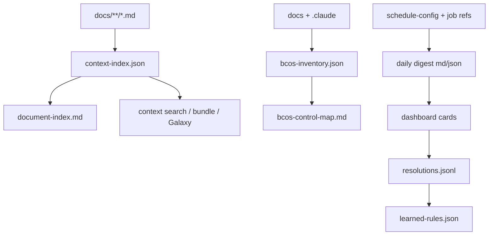

# BCOS Control Map

> **Generated:** 2026-05-05T23:28:08.817216Z by `.claude/scripts/bcos_inventory.py`
>
> Do not hand-edit this file. Regenerate with `python .claude/scripts/bcos_inventory.py`.

## Ownership Specification

**DOMAIN:** Developer and AI navigation map for the local BCOS environment.

**EXCLUSIVELY_OWNS:** Inventory of BCOS artifacts, generated outputs, workflows, triggers, plans, and maintenance risks.

**STRICTLY_AVOIDS:** Business truth, strategic decisions, and source content owned by canonical data points.

## At a Glance

| Surface | Count |
|---|---|
| Documents | 60 |
| Artifacts | 343 |
| Skills | 17 |
| Agents | 3 |
| Jobs | 11 |
| Plans | 9 |
| Risks | 2 |

## Artifact Formats

| Format | Count |
|---|---|
| css | 2 |
| html | 4 |
| js | 2 |
| json | 42 |
| jsonl | 1 |
| log | 1 |
| markdown | 178 |
| python | 91 |
| shell | 6 |
| svg | 2 |
| template | 1 |
| tmpl | 8 |
| unknown | 3 |
| yaml | 2 |

## Source Modes

| Mode | Count | Meaning |
|---|---|---|
| mechanical | 8 | Deterministically generated by scripts/jobs. |
| human-or-llm | 57 | Canonical docs edited by user/AI. |
| mixed | 1 | Mechanical scaffold plus human/AI judgment. |
| llm-instruction | 77 | Skills/agents that guide AI behavior. |
| code | 146 | Executable scripts/hooks. |
| config-or-derived | 32 | Runtime state or editable config. |
| append-only-log | 1 | Event logs; append, do not rewrite casually. |

## Generated Outputs

| Path | Producer | Mode | Exists | Purpose |
|---|---|---|---|---|
| .claude/quality/bcos-inventory.json | .claude/scripts/bcos_inventory.py | mechanical | yes | Machine-readable BCOS control map. |
| .claude/quality/context-index.json | .claude/scripts/context_index.py | mechanical | yes | Canonical indexed model of docs/. |
| .claude/quality/ecosystem/learned-rules.json | .claude/scripts/promote_resolutions.py | mechanical | yes | Derived self-learning rule set. |
| .claude/quality/ecosystem/state.json | .claude/scripts/refresh_ecosystem_state.py | mechanical | yes | Skill/agent ecosystem inventory. |
| docs/.wake-up-context.md | .claude/scripts/generate_wakeup_context.py | mechanical | yes | Session-start compressed context snapshot. |
| docs/_inbox/daily-digest.json | .claude/scripts/digest_sidecar.py | mechanical | yes | Typed-event sidecar consumed by dashboard cards. |
| docs/_inbox/daily-digest.md | schedule-dispatcher | mixed | yes | Daily maintenance digest; overwritten by scheduled runs. |
| docs/bcos-control-map.md | .claude/scripts/bcos_inventory.py | mechanical | yes | Human-readable BCOS control map generated from bcos-inventory.json. |
| docs/document-index.md | .claude/scripts/build_document_index.py | mechanical | yes | Human-readable document index generated from context-index. |

## Working Document Inventory

| Path | Zone | Type | Status | Cluster | Updated | Frontmatter |
|---|---|---|---|---|---|---|
| docs/_bcos-framework/architecture/collections-zone.md | framework | - | - | - | 2026-05-05 | no |
| docs/_bcos-framework/architecture/component-standards.md | framework | - | - | - | 2026-04-09 | no |
| docs/_bcos-framework/architecture/content-routing.md | framework | - | - | - | 2026-05-06 | no |
| docs/_bcos-framework/architecture/context-routing.md | framework | - | - | - | 2026-05-05 | no |
| docs/_bcos-framework/architecture/context-zones.md | framework | - | - | - | 2026-05-06 | no |
| docs/_bcos-framework/architecture/lifecycle-routing.md | framework | context | active | bcos-framework | 2026-05-05 | yes |
| docs/_bcos-framework/architecture/maintenance-lifecycle.md | framework | - | - | - | 2026-05-06 | no |
| docs/_bcos-framework/architecture/metadata-system.md | framework | - | - | - | 2026-05-05 | no |
| docs/_bcos-framework/architecture/system-design.md | framework | - | - | - | 2026-05-06 | no |
| docs/_bcos-framework/architecture/typed-events.md | framework | - | - | - | 2026-05-06 | no |
| docs/_bcos-framework/architecture/wiki-headless-scripts.md | framework | architecture | - | - | 2026-05-06 | yes |
| docs/_bcos-framework/architecture/wiki-zone.md | framework | - | - | - | 2026-05-05 | no |
| docs/_bcos-framework/guides/adoption-tiers.md | framework | - | - | - | 2026-04-09 | no |
| docs/_bcos-framework/guides/defining-your-context.md | framework | - | - | - | 2026-04-09 | no |
| docs/_bcos-framework/guides/folder-conventions.md | framework | - | - | - | 2026-05-05 | no |
| docs/_bcos-framework/guides/for-non-technical-users.md | framework | - | - | - | 2026-04-09 | no |
| docs/_bcos-framework/guides/getting-started.md | framework | - | - | - | 2026-04-09 | no |
| docs/_bcos-framework/guides/gitignore-profiles.md | framework | - | - | - | 2026-04-29 | no |
| docs/_bcos-framework/guides/maintenance-guide.md | framework | - | - | - | 2026-04-09 | no |
| docs/_bcos-framework/guides/migration-guide.md | framework | - | - | - | 2026-04-17 | no |
| docs/_bcos-framework/guides/private-folder-guide.md | framework | - | - | - | 2026-04-30 | no |
| docs/_bcos-framework/guides/scheduling.md | framework | - | - | - | 2026-04-23 | no |
| docs/_bcos-framework/methodology/clear-principles.md | framework | - | - | - | 2026-04-09 | no |
| docs/_bcos-framework/methodology/context-architecture.md | framework | - | - | - | 2026-04-09 | no |
| docs/_bcos-framework/methodology/decision-framework.md | framework | - | - | - | 2026-04-09 | no |
| docs/_bcos-framework/methodology/document-standards.md | framework | - | - | - | 2026-05-06 | no |
| docs/_bcos-framework/methodology/ownership-specification.md | framework | - | - | - | 2026-04-09 | no |
| docs/_bcos-framework/patterns/client-project-pattern.md | framework | - | - | - | 2026-04-22 | no |
| docs/_bcos-framework/patterns/gtm-pattern.md | framework | - | - | - | 2026-04-22 | no |
| docs/_bcos-framework/patterns/internal-tool-app-pattern.md | framework | - | - | - | 2026-04-22 | no |
| docs/_bcos-framework/patterns/internal-tool-automation-pattern.md | framework | - | - | - | 2026-04-22 | no |
| docs/_bcos-framework/patterns/marketing-pattern.md | framework | - | - | - | 2026-04-22 | no |
| docs/_bcos-framework/patterns/operational-pattern.md | framework | - | - | - | 2026-04-22 | no |
| docs/_bcos-framework/patterns/product-development-pattern.md | framework | - | - | - | 2026-04-22 | no |
| docs/_bcos-framework/patterns/product-service-pattern.md | framework | - | - | - | 2026-04-22 | no |
| docs/_bcos-framework/templates/context-architecture-canvas.md | framework | - | - | - | 2026-04-09 | no |
| docs/_bcos-framework/templates/context-cluster.md | framework | - | - | - | 2026-04-09 | no |
| docs/_bcos-framework/templates/context-data-point.md | framework | - | - | - | 2026-04-09 | no |
| docs/_bcos-framework/templates/current-state.client-project.md | framework | - | - | - | 2026-04-22 | no |
| docs/_bcos-framework/templates/current-state.internal-tool.md | framework | - | - | - | 2026-04-22 | no |
| docs/_bcos-framework/templates/current-state.md | framework | - | - | - | 2026-04-09 | no |
| docs/_bcos-framework/templates/maintenance-checklist.md | framework | - | - | - | 2026-04-09 | no |
| docs/_bcos-framework/templates/private-starter/README.md | framework | - | - | - | 2026-04-09 | no |
| docs/_bcos-framework/templates/private-starter/release-guide.md | framework | - | - | - | 2026-04-09 | no |
| docs/_bcos-framework/templates/session-diary-starter.md | framework | - | - | - | 2026-04-27 | no |
| docs/_bcos-framework/templates/table-of-context.client-project.md | framework | - | - | - | 2026-04-22 | no |
| docs/_bcos-framework/templates/table-of-context.internal-tool.md | framework | - | - | - | 2026-04-22 | no |
| docs/_bcos-framework/templates/table-of-context.md | framework | - | - | - | 2026-04-09 | no |
| docs/bcos-control-map.md | generated | reference | active | Framework Operations | 2026-05-05 | yes |
| docs/document-index.md | generated | - | - | - | 2026-05-06 | no |
| docs/_inbox/daily-digest.md | inbox | - | - | - | 2026-05-05 | no |
| docs/_planned/autonomy-ux-self-learning/README.md | planned | orientation | awaiting_approval | Framework Evolution | 2026-05-04 | yes |
| docs/_planned/autonomy-ux-self-learning/implementation-plan.md | planned | playbook | approved | Framework Evolution | 2026-05-05 | yes |
| docs/_planned/autonomy-ux-self-learning/pre-flight-decisions.md | planned | decision-log | defaulted | Framework Evolution | 2026-05-04 | yes |
| docs/_planned/autonomy-ux-self-learning/review-notes-2026-05-05.md | planned | review | defaulted | Framework Evolution | 2026-05-05 | yes |
| docs/_planned/lifecycle-sweep/implementation-plan.md | planned | - | awaiting_approval | - | 2026-05-05 | yes |
| docs/_planned/wiki-headless-scripts/implementation-plan.md | planned | playbook | planned | Framework Evolution | 2026-05-05 | yes |
| docs/_planned/wiki-missing-layers/README.md | planned | reference | completed | Framework Evolution | 2026-05-04 | yes |
| docs/_planned/wiki-missing-layers/implementation-plan.md | planned | playbook | completed | Framework Evolution | 2026-05-04 | yes |
| docs/_planned/wiki-missing-layers/pre-flight-decisions.md | planned | reference | approved | Framework Evolution | 2026-05-04 | yes |

## Skills And Agents

| Kind | ID | Path | Instruction File |
|---|---|---|---|
| skill | bcos-wiki | .claude/skills/bcos-wiki/SKILL.md | yes |
| skill | clear-planner | .claude/skills/clear-planner/SKILL.md | yes |
| skill | context-audit | .claude/skills/context-audit/SKILL.md | yes |
| skill | context-ingest | .claude/skills/context-ingest/SKILL.md | yes |
| skill | context-mine | .claude/skills/context-mine/SKILL.md | yes |
| skill | context-onboarding | .claude/skills/context-onboarding/SKILL.md | yes |
| skill | context-routing | .claude/skills/context-routing/SKILL.md | yes |
| skill | core-discipline | .claude/skills/core-discipline/SKILL.md | yes |
| skill | daydream | .claude/skills/daydream/SKILL.md | yes |
| skill | doc-lint | .claude/skills/doc-lint/SKILL.md | yes |
| skill | ecosystem-manager | .claude/skills/ecosystem-manager/SKILL.md | yes |
| skill | learning | .claude/skills/learning/SKILL.md | yes |
| skill | lessons-consolidate | .claude/skills/lessons-consolidate/SKILL.md | yes |
| skill | schedule-dispatcher | .claude/skills/schedule-dispatcher/SKILL.md | yes |
| skill | schedule-tune | .claude/skills/schedule-tune/SKILL.md | yes |
| skill | skill-discovery | .claude/skills/skill-discovery | no |
| skill | todo-utilities | .claude/skills/todo-utilities/SKILL.md | yes |
| agent | agent-discovery | .claude/agents/agent-discovery | no |
| agent | explore | .claude/agents/explore/AGENT.md | yes |
| agent | wiki-fetch | .claude/agents/wiki-fetch/AGENT.md | yes |

## Scheduled Jobs And Triggers

| Job | Enabled | Schedule | Reference | Finding Types |
|---|---|---|---|---|
| architecture-review | True | 1st | .claude/skills/schedule-dispatcher/references/job-architecture-review.md | integration-coverage-gap |
| audit-inbox | True | fri | .claude/skills/schedule-dispatcher/references/job-audit-inbox.md | missing-frontmatter |
| auto-fix-audit | True | fri | .claude/skills/schedule-dispatcher/references/job-auto-fix-audit.md | rule-reversal-spike |
| daydream-deep | True | wed | .claude/skills/schedule-dispatcher/references/job-daydream-deep.md | architecture-misalignment |
| daydream-lessons | True | mon | .claude/skills/schedule-dispatcher/references/job-daydream-lessons.md | daydream-observation |
| index-health | True | daily | .claude/skills/schedule-dispatcher/references/job-index-health.md | missing-frontmatter |
| lifecycle-sweep | True | fri | .claude/skills/schedule-dispatcher/references/job-lifecycle-sweep.md | lifecycle-trigger-fired |
| wiki-coverage-audit | True | 0 0 1 */3 * | .claude/skills/schedule-dispatcher/references/job-wiki-coverage-audit.md | coverage-gap-data-point |
| wiki-graveyard | True | 1st | .claude/skills/schedule-dispatcher/references/job-wiki-graveyard.md | graveyard-stale |
| wiki-source-refresh | True | mon | .claude/skills/schedule-dispatcher/references/job-wiki-source-refresh.md | source-summary-upstream-changed |
| wiki-stale-propagation | True | daily | .claude/skills/schedule-dispatcher/references/job-wiki-stale-propagation.md | stale-propagation |

## Plans

| Plan | Status | Scenario | Tasks | Task Status Counts |
|---|---|---|---|---|
| .claude/quality/sessions/20260407_220000_mempalace-adoption/plan-manifest.json | awaiting_approval | agenting | 16 | pending:16 |
| .claude/quality/sessions/20260409_010000_bcos-framework-refactor/plan-manifest.json | awaiting_approval | mixed | 25 | pending:25 |
| .claude/quality/sessions/20260424_203941_bcos-dashboard-steps-4-7/plan-manifest.json | approved | agenting | 44 | pending:44 |
| .claude/quality/sessions/20260501_102818_ecosystem-state-drift-fix/plan-manifest.json | completed | agenting | 20 | pending:20 |
| .claude/quality/sessions/20260501_104136_galaxy-orbits-upgrade/plan-manifest.json | approved | agenting | 50 | completed:25, pending:25 |
| .claude/quality/sessions/20260505_130000_galaxy-ux-actions-plan/plan-manifest.json | approved | agenting | 35 | pending:35 |
| docs/_planned/autonomy-ux-self-learning/plan-manifest.json | completed-v1 | agenting | 79 | completed:71, deferred-future:8 |
| docs/_planned/lifecycle-sweep/plan-manifest.json | approved | agenting | 46 | completed:12, pending:34 |
| docs/_planned/wiki-missing-layers/plan-manifest.json | completed | agenting | 58 | completed:52, pending:6 |

## Workflow Graph



## Risks And Drift

| Severity | Area | Message |
|---|---|---|
| medium | context-baseline | Missing canonical context document: docs/table-of-context.md |
| medium | context-baseline | Missing canonical context document: docs/current-state.md |

## Regeneration

```powershell
python .claude/scripts/bcos_inventory.py
```

Machine-readable source: `.claude/quality/bcos-inventory.json`.
